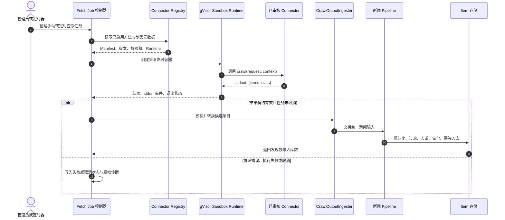
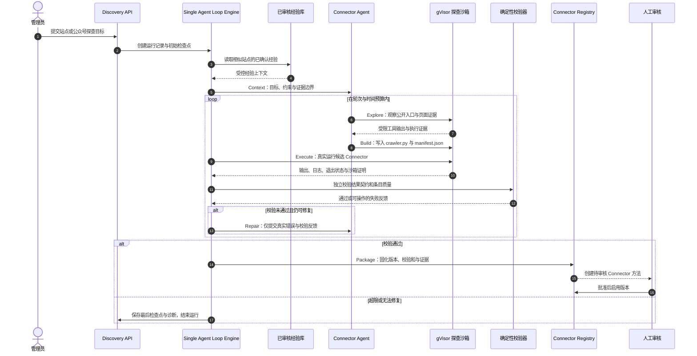
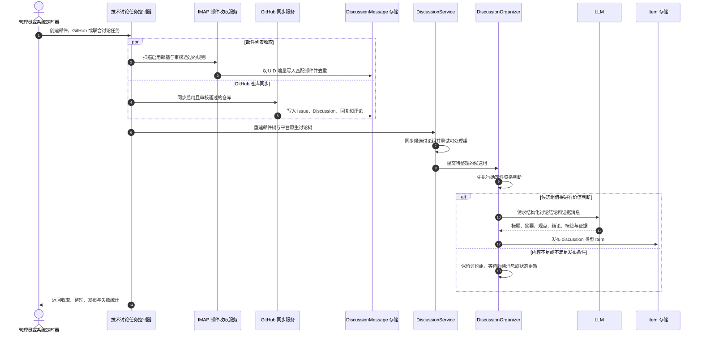
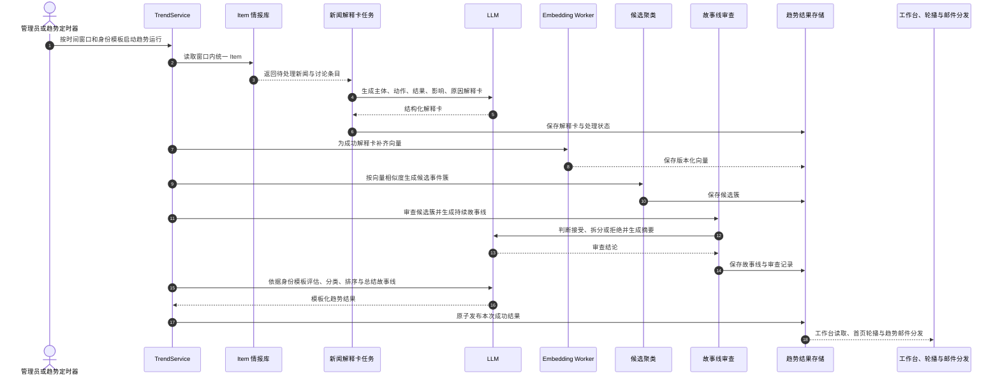

# OS News Tracker 技术架构说明

## 1. 问题背景与现存难题

OS News Tracker 是一个面向操作系统技术情报的采集、整理、分析与分发平台。它处理的不是单一新闻站，而是四类性质不同的信息入口：常规新闻源、经探查形成的站点 Connector、技术邮件列表，以及 GitHub 仓库中的 Issue、Discussion 和评论。它们最终都要成为可检索、可追溯、可用于趋势分析的统一情报条目。

系统需要同时解决以下问题：

| 难题 | 设计要求 |
| --- | --- |
| 信息源异构且持续变化 | RSS、HTML、搜索、API、邮件与 GitHub 的协议、分页、增量边界和数据结构不同，不能让下游页面感知这些差异。 |
| 新站点没有稳定采集规则 | 探查过程需要能探索未知站点，但生成的代码不能直接进入正式任务。 |
| 技术讨论噪声高、上下文长 | 邮件和 GitHub 评论必须按真实回复关系整理；补丁投递、常规故障和有价值的设计讨论需要区别处理。 |
| 自动化任务彼此独立又有关联 | 新闻源轮询、系统定时查取、趋势计算和邮件发送各自有调度规则，但统一依赖同一个数据底座。 |
| 结果必须可追溯 | 用户需要知道一条新闻或一个趋势来自哪些来源、经过哪些处理、为何进入当前结果。 |
| 安全与运行稳定性 | 自动生成或第三方站点的采集逻辑必须隔离执行，并具备取消、超时、失败记录和回退能力。 |

平台的关键取舍是：将探索性能力放在受控的“智能探查”中，将日常生产采集收敛为只执行已审核制品的“正式查取”；邮件与 GitHub 讨论先整理为标准情报条目，再与普通新闻一起参与趋势与分发。

## 2. 总体模块框架

下图是系统的模块堆积关系。每一层只依赖其下方的稳定能力；横向业务模块通过统一的 `Item` 情报模型汇合，而不是互相直接耦合。

```text
┌──────────────────────────────────────────────────────────────────────────────┐
│                              使用与运营界面                                    │
│  新闻流 · 站点发现 · 技术讨论（邮件 / GitHub）· 趋势工作台 · 统计与任务中心     │
│  来源方式库与审核 · 晨间查取面板 · 邮件模板、预览、预定发送                    │
├──────────────────────────────────────────────────────────────────────────────┤
│                               API 与访问控制                                   │
│  FastAPI 路由 · 管理访问校验 · 输入约束 · 运行状态与事件接口 · SSE / 轮询      │
├───────────────────────────────┬──────────────────────────────────────────────┤
│       信息接入与探查域         │                  情报消费域                  │
│  常规新闻源采集                │  新闻查询、筛选、详情与统计                  │
│  站点智能探查与 Connector 审核 │  趋势分析与趋势轮播                          │
│  Connector 正式查取            │  邮件预览、即时发送与预定发送                │
│  技术邮件收取与 GitHub 同步    │  审核提醒与运行历史                          │
├───────────────────────────────┴──────────────────────────────────────────────┤
│                              统一情报处理层                                    │
│  Discussion 整理 → Item  │  CrawlOutputIngester → Pipeline                  │
│  normalize · relevance-filter · dedup · enrich · 幂等存储                     │
├──────────────────────────────────────────────────────────────────────────────┤
│                             运行与治理能力                                     │
│  Connector Registry · 审核与版本 · 检查点 · 运行记录 · 调度器 · 日志脱敏       │
│  Sandbox Runtime（Docker + gVisor）· 容量队列 · 网络策略 · LLM / Embedding     │
├──────────────────────────────────────────────────────────────────────────────┤
│                                数据与基础设施                                  │
│  PostgreSQL（来源、方法、消息、讨论、Item、趋势、模板、任务日志）              │
│  版本化 Connector 文件 · 固定 Runtime 镜像 · 外部邮件、GitHub 与公开网站       │
└──────────────────────────────────────────────────────────────────────────────┘
```

### 2.1 统一数据核心

`Item` 是平台的情报核心。常规新闻与 Connector 结果经新闻 Pipeline 写入；技术邮件和 GitHub 讨论则先形成讨论组，再由整理器发布为 `Item`。因此首页检索、邮件分发、统计和趋势计算面对的是同一套条目与来源关联，而不是按采集渠道实现多套展示和分析逻辑。

| 上游 | 统一前的主要实体 | 汇合方式 | 下游可用能力 |
| --- | --- | --- | --- |
| RSS、页面监测、搜索、API | `Source` 与候选新闻 | `Pipeline` | 新闻流、筛选、统计、邮件、趋势 |
| 站点 / 公众号 Connector | `CrawlMethod`、Connector 输出 | `CrawlOutputIngester` + `Pipeline` | 新闻流、筛选、统计、邮件、趋势 |
| 技术邮件 | 邮箱连接、规则、`DiscussionMessage`、邮件讨论树 | `DiscussionOrganizer` 发布 `Item` | 讨论详情、新闻流、邮件、趋势 |
| GitHub | 仓库、Issue / Discussion / 评论、原生讨论树 | `DiscussionOrganizer` 发布 `Item` | 讨论详情、新闻流、邮件、趋势 |

## 3. 信息接入与正式查取

### 3.1 常规新闻源

这一类来源是系统已经认识、格式比较稳定的网站，例如提供 RSS 的技术博客或公开新闻接口。管理员先把网站地址和抓取频率配置好，系统就会按约定时间自动去查看有没有新内容；也可以通过网页列表、关键词搜索或公开接口获取新闻。

拿到内容后，系统会做一次统一整理，保证用户在新闻页面看到的是干净、可比较的信息：

1. 补齐和统一新闻的标题、原文链接、发布时间、摘要和正文；
2. 去掉与当前关注主题无关的内容；
3. 合并重复新闻，避免同一件事在列表中反复出现；
4. 标出新闻所属类别、重要程度和相关技术标签；
5. 保存新闻及其来源。下一次再次抓到同一条新闻时，系统会识别出来，不会重复新增。

### 3.2 Connector 正式查取

Connector 用于普通 Fetcher 无法覆盖、但已形成稳定采集方案的站点。它不是探查过程中的临时代码：正式查取只选择“已审核且启用”的方法，并通过统一 Runner 在 gVisor 沙箱中执行。



Connector 的 `manifest.json` 约束入口函数、允许访问的域名、运行时版本和校验和；`crawler.py` 只通过 `crawl(request, context)` 返回候选条目。Runner 将请求作为 JSON 输入，标准输出限定为一份结果 JSON，标准错误转换为运行事件。运行前会校验制品路径、入口、版本和签名；运行中保留退出状态、执行日志、发现数量与入库数量。

这一约束带来三项生产特性：

- 同一条正式执行入口同时服务手动查取与定时查取，避免两种场景出现不同的限量、部分成功或入库行为；
- 按 `run_id` 管理执行所有权和取消请求，任务被停止时可终止对应沙箱任务并保存已获得的诊断；
- 站点异常只影响当前方法，系统定时查取会继续处理后续方法，并在任务汇总中区分成功、部分成功、失败和取消。

### 3.3 系统定时查取的实际编排

系统存在相互独立的调度器：常规新闻源 Cron、系统定时查取、趋势定时计算，以及邮件预定发送。它们由独立开关启动，避免开发或运维场景中一个任务影响另一个任务。

其中“系统定时查取”不是只抓取网页。正常定时运行的顺序为：

```text
技术讨论收取与整理
  ├─ 扫描已启用的邮件连接和已审核的邮件规则
  ├─ 同步已启用、已审核的 GitHub 仓库
  └─ 整理并发布符合条件的技术讨论 Item

已审核 Connector 的逐方法正式查取
  └─ 每个方法在沙箱中执行，并通过新闻 Pipeline 入库
```

巡检补跑只重试当日失败或未执行的 Connector 方法，不重复扫描技术讨论邮箱。每个定时运行都保存方法级别的发现数、入库数、状态与错误摘要；进程中断后，系统会回收残留运行状态，避免面板永久显示“执行中”。

## 4. 智能探查：生成可审核的采集能力

智能探查解决新网站“能否稳定采集、应如何采集”的问题。普通网站生成各自独立的版本化 Python Connector；微信公众号则使用一个共享的匿名搜索 Connector，并在方法配置中保存公众号名称、关键词和分页参数。两种结果均必须经过相同审核门槛才能参与正式查取。

### 4.1 单 Agent Loop 的职责划分

探查采用程序控制的单 Agent Loop。程序掌握状态、阶段、轮数、时间预算、检查点、取消和验收；Agent 只负责观察站点、编写或修改 Connector。执行结果不能由 Agent 自行宣称，而必须来自实际沙箱运行和确定性校验。

| 阶段 | 主要职责 | 产生的可信产物 |
| --- | --- | --- |
| Context | 读取目标站点、限制条件和已审核经验 | 本次运行上下文与约束 |
| Explore | 探查公开入口、列表、详情、时间字段和停止条件 | 受边界限制的观察证据 |
| Build | 生成 Connector 源码和 Manifest | 待试运行的制品草案 |
| Execute | 在 gVisor 内真实运行制品 | 标准输出、标准错误、退出状态与沙箱证明 |
| Evaluate | 校验结果结构、条目质量、URL、正文与边界条件 | 可重复的验收结论 |
| Repair | 基于真实错误和验收反馈修复 | 新一轮候选制品 |
| Package | 固化版本、校验和和审核证据 | 待审核方法 |

探查过程的状态和事件持久化到运行记录中。前端可以查询当前阶段、轮次、检查点和经脱敏的事件，而不需要根据日志文本猜测进度。超过轮次或时间预算时，系统停止继续尝试，保留最后一份可诊断状态以供恢复或人工处理。



### 4.2 制品、审核与发布

普通网站 Connector 的目录按站点键与版本隔离：

```text
backend/connectors/sites/<connector_key>/v<version>/
├── manifest.json
└── crawler.py
```

新版本写入新目录，不覆盖已审核版本。Package 阶段将 Manifest、源文件校验和、运行时版本、试运行证据和质量结论绑定到待审核方法；审核通过后方法才可启用。审核者可在方式详情中查看制品源代码、执行摘要与从源码派生的执行路径说明。

运行失败达到阈值后，系统可以发起一次有边界的修复探查。修复无论是否成功，都会产生新的待审核版本，不会自动替换生产方法。这是站点变化下保持稳定运行和人工可控之间的边界。

### 4.3 沙箱、安全和经验复用

探查工具和 Connector 都在 Docker + gVisor 的临时容器中执行。容器不获得数据库连接、平台密钥、Docker Socket、项目源码或任意宿主机目录；正式查取仅只读挂载目标 Connector 制品。网络由 Manifest 声明的域名和出口策略共同限制，内网、环回地址、保留地址及云元数据地址不允许访问。

已审核的 Connector 与已确认的修复经验可进入经验库，供后续探查按站点特征、关键词和向量相似度检索。经验库不保存未验证草稿、新闻正文或认证信息；它帮助探索，但永远不能取代一次真实沙箱执行和确定性验收。

## 5. 技术讨论：邮件与 GitHub 的统一收取、整理和发布

技术讨论模块是普通新闻流之外的第二个重要输入域。它的目标不是把每封邮件或每条评论原样展示，而是识别长期值得跟踪的技术讨论，将其上下文、观点和进展整理为标准情报条目。

### 5.1 邮件列表收取

管理员配置 IMAP 邮箱连接；密码和用户名仅以环境变量键引用，不写入业务记录。每个邮件来源使用规则匹配邮件头，如 `List-Id`、`List-Post`、`Delivered-To`、`To`、`Cc` 或指定 Header。新建来源默认进入待审核状态，只有审核通过后来源与规则才会启用。

收取服务按邮箱的 UID 增量扫描，记录 UIDVALIDITY 与最近 UID，并通过 Message-ID 识别重复邮件。匹配规则的邮件被保存为 `DiscussionMessage`，随后按 `In-Reply-To` 和 `References` 重建邮件讨论树。任务支持协作式停止：停止后不再开始后续单元工作，已经持久化的收取结果会保留。

### 5.2 GitHub 仓库同步

GitHub 仓库同样先进入审核，再允许启用和同步。每个仓库可以独立配置：是否收取 Issue 和 Discussion、标签与分类白名单/黑名单、首次历史时间窗，以及 Token 的环境变量键。

同步服务按两种模式工作：

| 场景 | Issue | Discussion |
| --- | --- | --- |
| 首次历史收取 | 按日期切片搜索，避免单次搜索结果上限 | 游标分页，在配置的时间窗内读取 |
| 日常增量同步 | 按 `updated_at` 水位线读取，并补扫仓库级评论 | 按更新时间和游标增量读取 |

Issue、Discussion、回复和评论都规整为 `DiscussionMessage`。GitHub Discussion 及其评论保留平台原生父子关系；Issue 评论以其 Issue 作为上下文根节点。前端讨论详情可基于这些真实关系绘制交互式回复拓扑图，并在节点中展示翻译、摘要、证据标记与原始 GitHub 链接。



### 5.3 讨论组织与 `Item` 发布

邮件和 GitHub 同步完成后，系统会按下面的方式整理讨论：

1. 把同一条邮件往来，或同一个 GitHub Issue / Discussion 及其回复，归成一个候选讨论组；
2. 先过滤掉没有技术内容、重复通知或明显无效的讨论；
3. 对值得继续阅读的讨论，生成易读的标题、简短摘要和最新进展；
4. 提取讨论中的主要观点：大家达成了什么共识、在哪些地方意见不同、还有什么问题没有解决；
5. 标记讨论的结论状态、重要程度和相关技术标签，并记录这些判断分别来自哪些原始邮件或 GitHub 回复。

不是每个讨论都会出现在新闻列表中。只有同时满足以下条件的讨论，才会发布为 `Item`：

1. 内容涉及可复用的技术经验，例如架构设计、接口定义、兼容性、安全、性能优化或维护者作出的重要技术决定；
2. 讨论中确实有人交换观点、比较不同方案，或形成了明确结论。

发布后，用户仍可从新闻详情或趋势结论回到对应的讨论组，查看原始邮件、GitHub 回复和相关上下文。

## 6. 趋势分析：把新闻、邮件与 GitHub 讨论转成可验证趋势

趋势模块不区分条目最初来自网页、邮件还是 GitHub。它以统一 `Item` 为事实输入，逐步构建可审查的事件和故事线，最后在某个分析视角下生成趋势结果。这样 GitHub 与邮件中的关键技术决策可以和站点新闻共同影响趋势判断。

### 6.1 四段事实到观点的处理链



前三级构成可复用的事实层：解释卡对单条信息做结构化压缩，向量与聚类发现相近事件，故事线审查决定哪些事件可作为持续主题。第四级是观点层：用户维护“身份模板”，其中包含分析身份和关注方向；趋势运行在当前时间窗口内对故事线进行评分、分类、排序和摘要，发布一个与模板绑定的结果集。

### 6.2 质量与调度边界

趋势工作台允许分别观察和触发每个阶段，并展示待处理、生成、失败和已完成数量。趋势任务在后台运行；服务重启会把未完成运行标记为失败，而最近一次成功发布保持不变。

定时趋势计算使用独立调度器，并以北京时间解释每日或每周规则。调度器先串行补齐事实层：新闻卡、向量、候选簇、故事线审查；向量未完成时不发布趋势结果。每个计划时间点先持久化领取，防止进程重启或重复 tick 造成同一时刻多次运行。

趋势结果提供工作台列表和首页轮播两种读取模型。轮播会依据当前时间窗口过滤结果引用的 `Item`，因此调整窗口不会错误展示与当前范围无关的历史趋势。

## 7. 邮件分发与运营辅助能力

这里的“邮件分发”不同于前述“技术邮件收取”：前者是把平台内已整理的情报主动发送给订阅者或运营人员。

### 7.1 模板化分发

邮件模板保存筛选快照、主题、收件人、正文配置和公告块。预览服务从 `Item` 中按快照重新查询数据，生成包含标题、摘要、来源、质量信息和热点的邮件内容；因此预览和正式发送使用同一条数据选择逻辑。系统支持：

- 模板的创建、编辑、删除与即时预览；
- 立即发送普通新闻摘要；
- 趋势结果的预览和发送；
- 每日或每周的预定发送、暂停、恢复、立即补发和发送日志；
- 到点发送失败或查询为空时的巡检补发策略。

邮件服务通过可替换 Provider 发送，并将每次投递的状态、收件人、条目数量和错误写入 `MailDelivery`。邮件定时任务与新闻源、系统定时查取和趋势调度相互独立。

### 7.2 统计、运行日志与提示

统计页面从运行和用量记录中展示模型调用、查询执行、探查执行和新闻入库量。方式审核提醒可以由独立定时任务发送。各类长任务都将面向用户的阶段、数量、状态和错误摘要持久化：Connector 探查以事件流展示，技术讨论以运行事件展示，系统定时查取以运行及方法明细展示。

日志在持久化与展示前进行边界校验和脱敏。界面展示可核验的操作摘要、工具证据和错误原因，而不展示模型的私有推理过程。

## 8. 前端设计

前端采用 React、TypeScript、TanStack Query、React Router 和 ECharts/React Flow 等组件库。界面不是后端模块的简单镜像，而是围绕三类用户问题设计：现在有什么情报、某个能力是否可靠运行、下一步该由谁处理。

| 页面或区域 | 面向的问题 | 关键交互 |
| --- | --- | --- |
| 新闻流 | 有哪些值得关注的信息？ | 时间、来源、标签、类型筛选；排序；新闻详情与来源追溯。 |
| 站点发现 | 如何新增、审核和运行采集能力？ | 站点探查、技术讨论入口、方式库、待审核列表、方法详情与手动查取。 |
| 技术讨论面板 | 邮件与 GitHub 收到了什么，是否已整理？ | 运行进度、停止任务、来源/仓库库、审核、讨论组及回复拓扑图。 |
| 晨间查取面板 | 本次系统任务是否完整处理了讨论与 Connector？ | 配置、立即运行、停止、失败重试、时间线和逐方法统计。 |
| 趋势工作台 | 趋势从哪些事实形成，是否可信？ | 卡片、聚类、故事线、趋势四阶段状态；模板管理；结果与轮播。 |
| 邮件任务中心 | 哪些内容将被发给谁？ | 模板、预览、即时发送、趋势分发、预定任务及投递日志。 |
| 统计与发现 | 资源消耗和入库量是否健康？ | Token 用量、运行量、方式维度与时间维度图表。 |

管理类操作经系统访问状态保护；普通浏览可以读取已开放的新闻和方式信息。长任务在执行期间按状态轮询或消费事件流，完成后刷新关联查询。探查生命周期根据后端返回的 `phase` 和 `round` 显示，趋势工作台根据各阶段状态显示，避免前端通过解析日志文本自行推断任务状态。

## 9. 结论

OS News Tracker 的结构不是“一个网页爬虫加一个新闻页面”。它以统一 `Item` 为情报底座，将站点采集、邮件列表和 GitHub 技术讨论汇合，再向趋势计算、邮件分发、统计和前端浏览提供一致的事实来源。智能探查负责在严格隔离与审核条件下扩展采集能力；正式查取、讨论整理和趋势分析各自有清晰的运行边界、持久化状态和可追溯结果，从而支持长期运营。
