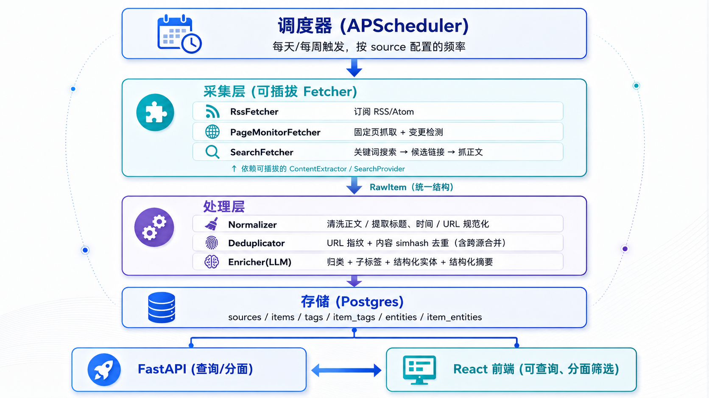

# 技术新闻追踪 Agent —— 设计文档（V1 / MVP）

- 文档日期：2026-06-09
- 状态：待用户评审
- 项目代号：`os-news-tracker`

---

## 1. 背景与目标

为公司内部团队（maintainer、研发、决策者）做一个**技术新闻追踪 Agent**，自动从多类来源采集技术情报，用 LLM 整理归纳成统一的结构化总结，汇总到一个**可查询的网页**上，支持按分类、标签、实体、时间检索。

整体产品由多个相对独立的子系统组成，采用**迭代开发**，本文档只定义 **V1（MVP）** 的范围与设计。

### 关注的信息类型（初始 5 类主分类）

1. `OS跟踪来源` —— 主流 OS 的跟踪来源与更新
2. `友商产品信息` —— 友商产品发布地、发布信息
3. `软件包适配` —— 各类新兴软件包的适配情况
4. `OS性能发展` —— OS 性能发展情况
5. `司内AI工具` —— 公司内部 AI 工具相关信息

---

## 2. 关键前提（已与用户确认）

| 维度 | 结论 |
| --- | --- |
| 部署环境 | 公司**内网部署**，但**可正常访问外网**（抓取公开来源无需代理/白名单） |
| AI 能力 | 调用**司内统一 LLM 网关/API**；具体调用方式后续用 iWiki MCP 查文档确认。设计上抽象为「可配置的 OpenAI 兼容 / 自定义 endpoint」 |
| 规模与频率 | **几十个来源**，一天 1-2 次或一周 1-2 次拉取（采集侧无性能压力） |
| 订阅对象 | 用户自助订阅（轻量） + 管理员定向配置（→ V2 实现） |
| 登录/身份 | V1 **轻量化**：基于邮箱的订阅 + 管理员简单凭证，不引入复杂鉴权 |
| tag 体系 | 管理员维护**一级主分类** + AI 在每条信息上**自动抽取细粒度子标签** |
| 知识图谱 | V1 做**轻量结构化实体抽取 + 分面检索**，专用图数据库/语义检索留到后期 |
| 技术栈 | **Python 后端（FastAPI）+ 现代 JS 前端（React）** |
| 整体编排 | **方案 A：确定性流水线 + 局部轻量 LLM**（非自主 Agent 循环）。**明确不需要 agent**，理由见第 14 节 |
| 采集源类型 | **4 类 Fetcher**：`rss` / `api`（结构化 JSON/XML 接口）/ `page_monitor`（爬网页）/ `search`（关键词）。邮件列表归档作为 `page_monitor` 变体，V1 暂不收 |
| 信息分流 | **两条流**：①新闻动态流（Blog/News/Release Notes）走 LLM 结构化摘要；②结构化事实流（CVE/EOL/镜像）直接解析入库、按字段筛选展示。详见第 5.9 节 |
| 采集/提取引擎 | **Scrapling 作默认引擎 + 可插拔接口**；Firecrawl 作后续可选项 |
| 搜索源 | 优先**司内联网能力**（待 iWiki MCP 确认）；否则 Firecrawl `/search` 或外部 API。接口可插拔 |

---

## 3. 迭代路线图（全局视角）

- **V1（本文档）**：采集（RSS + 结构化 API + 固定页监控 + 关键词搜索，四类）→ 两条流处理（新闻流走 AI 摘要；结构化流直接解析入库）→ 可查询网页（新闻列表 + 结构化数据表）。结构化流 V1 收**安全公告/CVE、生命周期/EOL、镜像适配**三类；repo 包元数据、邮件列表归档留到后期。
- **V2**：订阅体系（邮箱自助订阅 + 管理员定向配置）+ 邮件推送。
- **V3**：iWiki 联动（MCP 或写接口把摘要写到 iWiki）。
- **V4**：采集源管理后台、抓取健康度监控、AI 成本/质量看板。
- **V5**：语义检索、关系图谱、推送个性化、去重/聚类优化。

> V1 明确**不做**：邮件/iWiki 推送、订阅体系、复杂登录鉴权、采集源管理后台、语义搜索、关系图谱。

---

## 4. 总体架构（V1）



---

## 5. 组件设计

每个组件单一职责、通过明确接口通信、可独立测试。

### 5.1 Source Registry（采集源注册）

- 维护所有采集源的配置：类型、URL、抓取频率、关键词、所属主分类候选、启用状态、健康状态。
- V1 用**配置文件 + 数据库表**双轨（配置文件做初始 seed，运行态读库）；可视化管理后台留到 V4。

### 5.2 Fetcher（可插拔采集器）

统一接口：

```python
class Fetcher(Protocol):
    def fetch(self, source: Source) -> list[RawItem]: ...
```

四种实现互不依赖（新增 `ApiFetcher`）：

- **RssFetcher**：解析 RSS/Atom（如 `feedparser`），产出条目。→ 进**新闻流**。
- **ApiFetcher**：拉取结构化 JSON/XML 接口。**每个 API 有自己的 schema，因此配一个轻量"源适配器"（adapter）**把原始响应映射成统一记录。→ 进**结构化流**（见 5.9）。覆盖 RH Security Data / Life Cycle / Pyxis、Ubuntu Security/Launchpad/SimpleStreams/releases.yaml、openEuler/Anolis CSAF 等。
- **PageMonitorFetcher**：抓取已知固定页，做变更检测（对比上次内容指纹），有新内容才产出。依赖 `ContentExtractor`。利用 Scrapling 的**自适应解析**应对页面改版。→ 多数进**新闻流**。
- **SearchFetcher**：用关键词调 `SearchProvider` 拿候选链接 → 对每个链接用 `ContentExtractor` 抓正文 → 嵌入**轻量 LLM 判定相关性**后产出（这是 V1 唯一的局部 agentic 环节，仍受控）。→ 进**新闻流**。

> 为什么不用 agent 统一抓取：这 4 类源的格式**已知且稳定**，复杂度在于"格式多样"而非"需要运行时自主决策"。正确做法是**按源类型写小适配器 + 配置驱动**，而非 agent。详见第 14 节。

**相关性预过滤（针对高量源）**：部分 RSS 源（尤其 arXiv 论文合并 feed、顶会）量大且噪声多。对 `relevance_filter=true` 的源，在 Normalizer 之后、Enricher 之前插入一步**轻量过滤**——先用 `relevance_keywords` 做廉价关键词初筛，命中再用一次轻量 LLM 判定是否与"OS 性能"相关；不相关直接丢弃，不进 Enricher、不入库。这复用 `SearchFetcher` 里的相关性判定逻辑，把噪声和 LLM 成本压在源头。

**反爬说明**：部分源（如 Phoronix）会触发 Cloudflare 403/Turnstile。Scrapling 的 `StealthyFetcher` 可自动处理，这正是选它作默认引擎的实际理由之一；个别源仍可降级到对应的新闻 feed。

### 5.3 ContentExtractor（可插拔正文提取引擎）

```python
class ContentExtractor(Protocol):
    def extract(self, url: str) -> ExtractedDoc: ...   # 干净正文 + 元数据
```

- **V1 默认实现：`ScraplingExtractor`** —— 轻量库、零额外服务、自适应解析、强反爬（StealthyFetcher 可过 Cloudflare）。
- **可选实现：`FirecrawlExtractor`** —— 后续需要高质量 LLM-ready markdown 时启用。注意 Firecrawl 为 **AGPL-3.0**，且自部署需 Docker + Redis + Playwright，引入前需走法务确认。

### 5.4 SearchProvider（可插拔搜索源）

```python
class SearchProvider(Protocol):
    def search(self, query: str) -> list[SearchResult]: ...   # 链接 + 摘要
```

- **优先：`InternalGatewaySearch`** —— 若司内 LLM 网关自带联网搜索能力（待 iWiki MCP 确认），最优（合规、免费、走内部通道）。
- **备选：`FirecrawlSearch`**（自部署配 SearXNG）或外部 API（Tavily / Google Programmable Search）。

### 5.5 Normalizer

- 把各来源的杂乱字段统一成干净正文 + 标准元数据（标题、发布时间、规范化 URL）。
- URL 规范化（去 utm、统一协议/末尾斜杠）用于去重。

### 5.6 Deduplicator

- 一级：规范化 URL 指纹（`url_hash`）精确去重。
- 二级：内容 `simhash` 近似去重，识别同一新闻的多源命中。
- **跨源合并展示策略**：同一新闻多源命中时**合并为一条** item，详情页列出「多个来源链接」，避免列表刷屏。

### 5.7 Enricher（唯一的 LLM 环节）

- 一次 LLM 调用同时产出：主分类、细粒度子标签、结构化实体、**结构化摘要**（见第 7 节）。
- 输出带 `llm_confidence`；低置信度条目入库但标记待人工复核。
- 结果按 `content_hash` **缓存**，重跑不重复花钱。

### 5.8 API + 前端

- FastAPI 提供分面检索 + 全文搜索 + 详情接口。
- React 前端：**两类视图**——①新闻列表页（快速扫读）+ 详情页（结构化摘要展示）+ 分面筛选侧栏；②结构化数据表页（CVE/安全公告、生命周期/EOL、镜像适配），按字段筛选与排序。

### 5.9 结构化事实流（Structured Data Stream）

新闻流之外的第二条流，专门处理**机读的结构化事实数据**，**不走 LLM 摘要**（既省钱又避免失真），直接解析入库、按字段展示与检索。

- **数据来源**：由 `ApiFetcher`（部分由 `page_monitor` 抓结构化页）产出。
- **处理方式**：每个源一个**适配器**，把原始响应（CSAF/JSON/XML/YAML）映射成对应的结构化表记录；用源内的稳定主键（如 CVE 号、advisory id、产品+版本、镜像 tag）做**幂等 upsert**。
- **V1 收三类**：
  1. **安全公告 / CVE** —— RH Security Data、Ubuntu Security（notices/cves/releases.json）、openEuler/Anolis CSAF。
  2. **产品生命周期 / EOL** —— RH Product Life Cycle、Ubuntu releases.yaml、各 OS 生命周期。
  3. **镜像适配** —— RH Pyxis Catalog、Ubuntu Cloud Images SimpleStreams。
  4. **软件包适配 / 兼容性（快照模式）** —— openEuler 兼容性中心、Anolis eco、RH Catalog、Ubuntu Certified、各包查询站。**V1 只存最新快照、可检索展示，不做 diff**（"新适配/新认证"变化追踪留后期）。
- **V1 不收**：repo 包版本元数据（`primary.xml.gz`，量大、信噪比低）、邮件列表归档——留到后期；如果将来要做包级跟踪，只跟重点包（如 kernel）。
- **论文/研究**：arXiv 合并 feed 与顶会走**新闻流**（不是结构化流），但开启**相关性预过滤**控量（见 5.2）。DBLP→RSS 公益脚本不稳，**建议改用 DBLP 官方 API**（`api` 适配器）。
- **可选的 LLM 轻量归纳**：在结构化数据之上，可（按需、非必须）对"本周新增高危 CVE / 临近 EOL"等做一句话归纳，复用 Enricher，但不是入库前置步骤。

---

## 6. 数据模型（Postgres，关键表）

```sql
sources(
  id, name, type,            -- type: rss | api | page_monitor | search
  url, keywords,             -- search 类型用 keywords
  adapter,                   -- api 类型用：指定源适配器名（如 redhat_securitydata）
  stream,                    -- news | structured（决定走哪条流）
  fetch_cron,                -- 抓取频率
  vendor,                    -- redhat | ubuntu | openeuler | openanolis ...
  main_category,             -- 候选主分类
  relevance_filter,          -- 布尔：高量源（如论文 feed）入库前先做相关性预过滤
  relevance_keywords,        -- 该源的相关性关键词（如 "scheduler, IO, kernel, performance"）
  enabled, last_run_at,
  health_status, fail_count,
  last_content_hash          -- page_monitor 变更检测用
)

items(
  id, source_id,
  title, url, url_hash, content_hash,
  raw_content, clean_content,
  published_at, fetched_at,
  main_category,
  -- 结构化摘要字段（见第 7 节）
  title_tldr, summary, key_points,   -- key_points: jsonb 数组
  info_type, importance, why_it_matters,
  status,                    -- new | enriched | enrich_failed | needs_review
  llm_confidence
)

item_sources(item_id, source_id, url)   -- 跨源合并：一条 item 对应多个来源链接

tags(id, name, kind)                     -- kind: main_category | sub_tag
item_tags(item_id, tag_id)

entities(id, type, name)                 -- type: vendor|product|os|package|version|topic
item_entities(item_id, entity_id, role)
```

**结构化流的表**（不进 `items`，独立建表，按字段直接查）：

```sql
-- 安全公告 / CVE
security_advisories(
  id, source_id, vendor,
  advisory_id,               -- RHSA/USN/ANSA... 源内唯一
  cve_ids,                   -- jsonb 数组
  severity,                  -- critical|important|moderate|low（按各源归一）
  title, summary_text,       -- 取自源，非 LLM 生成
  affected_products,         -- jsonb
  fixed_versions,            -- jsonb
  published_at, updated_at,
  url,
  UNIQUE(vendor, advisory_id)
)

-- 产品生命周期 / EOL
product_lifecycles(
  id, source_id, vendor,
  product, version,
  release_date, ga_date, eol_date, eus_date,
  phase,                     -- full_support | maintenance | eol ...
  url,
  UNIQUE(vendor, product, version)
)

-- 镜像适配
image_releases(
  id, source_id, vendor,
  product, image_tag, arch,
  cloud,                     -- aws|azure|gce|openstack|lxd...（SimpleStreams）
  image_id, checksum,
  released_at,
  UNIQUE(vendor, product, image_tag, arch, cloud)
)

-- 软件包适配 / 兼容性（V1 = 快照模式，不做 diff）
compatibility_entries(
  id, source_id, vendor,
  kind,                      -- hardware | software | package | image | osv
  name,                      -- 包名/硬件型号/软件名
  product, version, arch,
  status,                    -- certified | compatible | available ...
  snapshot_at,               -- 本次快照时间（V1 仅留最新快照；变化追踪留后期）
  url,
  UNIQUE(vendor, kind, name, product, version, arch)
)
```

- 全文检索：Postgres `tsvector` + GIN 索引（V1 足够；语义检索留 V5）。
- 新闻流分面字段（main_category、info_type、importance、published_at、entity）建索引。
- 结构化流按各表的查询维度（vendor、severity、eol_date、product 等）建索引。

---

## 7. 信息总结标准结构（已与用户确认）

每条信息由 Enricher 一次产出固定结构化字段，前端/未来推送统一复用：

| 字段 | 说明 |
| --- | --- |
| `title_tldr` | 一句话概括（≤30 字，列表页直接看） |
| `summary` | 核心摘要（2-4 句，说清发生了什么） |
| `key_points` | 关键点（3-5 条 bullet，存 jsonb 数组） |
| `info_type` | 信息类型：`发布` \| `更新` \| `性能数据` \| `适配` \| `论文/研究` \| `观点/分析` \| `其他` |
| `importance` | 重要度：`高` \| `中` \| `低`（给 V2 推送排序/过滤用） |
| `why_it_matters` | 影响/意义（1-2 句，面向 maintainer 的"所以呢"） |
| `entities` | 结构化实体：厂商/产品/OS/软件包/版本/主题 |
| `main_category` | 主分类（5 类之一） |
| `sub_tags` | 细粒度子标签 |
| `source` / `url` / `published_at` / `llm_confidence` | 元数据 |

### 前端展示要求

- **列表页**：`title_tldr` + `info_type` + `importance` + 主分类，一行扫读。
- **详情页**：展开 `summary` + `key_points` + `why_it_matters` + 实体 + 多来源链接。
- **每个区块在视觉上必须做区分**：例如 `key_points` 用列表卡片、`importance` 用色彩标签（高=红/橙、中=黄、低=灰）、`why_it_matters` 用强调块、`info_type` 用 badge。

---

## 8. 数据流（一次采集，端到端）

1. 调度器按各 source 的 `fetch_cron` 触发。
2. 对应 Fetcher 拉取 → 产出 `RawItem`。
3. Normalizer 清洗 → 标准化元数据。
4. Deduplicator 判重：已存在 URL → 追加到 `item_sources`（跨源合并）；全新 → 进入下一步。
5. Enricher 调司内 LLM 网关，产出结构化摘要 + 分类 + 实体（命中缓存则跳过）。
6. 写入 `items` / `tags` / `entities` 等表。
7. 前端即可查询展示。

**幂等保证**：同一条目重复跑不产生重复记录或重复 LLM 调用（依赖 `url_hash` / `content_hash`）。

**结构化流的数据流**（不走 4-5 步的 LLM 环节）：调度触发 → `ApiFetcher` 拉取 → 源适配器解析映射 → 按源内稳定主键（CVE 号 / advisory id / 产品+版本 / 镜像 tag）**upsert** 进对应结构化表 → 前端结构化数据表页直接查。幂等性由表的 `UNIQUE` 约束保证。

---

## 9. 错误处理与稳健性

- 单个源失败**隔离**，不影响其他源；累积 `fail_count`，更新 `health_status`。
- LLM 调用：超时/限流自动重试（指数退避）；多次失败标 `status=enrich_failed`，下轮补处理，不阻塞展示。
- 抓取**合规**：只抓公开信息、遵守 `robots`、每站限速 + 合理 UA；友商页面按天级低频抓取，不做激进爬取。
- 所有外部调用设超时；pipeline 有整体看护日志。

---

## 10. 高性能策略（贴合规模）

- 采集侧用 `asyncio` 并发抓取（几十个源秒级完成），**不引入** Celery/队列等重组件（YAGNI）。
- LLM 调用做**批处理 + 并发上限**控制成本与限流。
- 查询侧性能靠**索引设计**：分面字段索引、全文 GIN 索引、分页游标——这是「高性能」体感的关键。
- LLM 结果按 `content_hash` **缓存**，重跑不重复花钱。

---

## 11. 测试策略

- **Fetcher**：本地 fixture（保存的 RSS/HTML 样本）单测，不依赖外网。
- **ApiFetcher + 源适配器**：用保存的真实 API 响应样本（CSAF/JSON/YAML）做单测，校验"原始响应 → 结构化记录"映射；并测 upsert 幂等（重复跑不产生重复行）。
- **Normalizer / Deduplicator**：纯函数，覆盖边界（URL 规范化、simhash 近似）。
- **Enricher**：mock LLM 网关，校验 prompt 构造与结构化输出解析。
- **API**：集成测试 + 两条端到端 smoke（新闻流 fixture → 入库 → 查询；结构化流 fixture → upsert → 按字段查）。

---

## 12. 部署形态（V1）

- 单机 **Docker Compose**：FastAPI + Postgres + 前端静态资源 + 调度进程。
- 数据保留：历史**永久留存**（追踪需要时间线），不自动清理；大字段（`raw_content`）可后续归档。
- 后续要上内部发布平台再迁移。

---

## 13. 待办/待确认（不阻塞 V1 设计，落地时处理）

- [ ] 用 iWiki MCP 查清司内 LLM 网关的调用方式（endpoint、鉴权、是否带联网搜索）。
- [ ] 确认外部搜索 API（若内部无联网能力）的可用性与合规。
- [ ] 确认 Firecrawl AGPL-3.0 在公司内部自用的法务结论（仅在引入 Firecrawl 时需要）。
- [x] 初始采集源清单 —— 附录 A（主流 OS 跟踪，4 家）、附录 B（OS 性能发展）、附录 C（软件包适配/兼容性）已就绪。剩余主分类（友商产品信息、司内 AI 工具）的源清单后续补。
- [ ] DBLP 官方 API 的查询/分页细节（用于顶会论文 `api` 适配器，替代第三方 RSS 脚本）。
- [ ] OpenBenchmarking 结果页的定向解析字段（若要把基准数据结构化，否则先按 page_monitor 当新闻处理）。
- [ ] 各结构化 API 的响应字段细节 → 落地时为每个源写适配器时确认（schema、分页、限流）。

---

## 14. 为什么 V1 不用 agent 架构（设计决策记录）

**判断标准**：是否需要"运行时自主决策"（多步规划、工具调用循环、跨步骤记忆、自主决定下一步）。

**结论**：V1 不需要 agent，也不需要多 agent。

- **采集环节**：全部 4 类源（rss / api / page_monitor / search）格式**已知且稳定**——固定 RSS、有 schema 的 JSON/XML、版式稳定的文档页。复杂度在于"格式多样"，对策是**按源类型写小适配器 + 配置驱动**，不是 agent。强行上 agent（如 LangGraph）只会带来不可预测、难调试、token 翻倍，无任何收益——典型过度设计。
- **AI 环节**：LLM 只做两件**单次、定义明确的转换**——①搜索结果相关性判断（二分类）；②新闻的结构化摘要（归类/子标签/实体/摘要）。都不需要 agent 能力。
- **结构化数据**：CVE/EOL/镜像本身机读，**直接解析入库**，用 LLM 反而失真浪费。

**"Agent 应用" 的定位**：是产品命名，不是架构要求。系统价值在"好的流水线 + 好的 prompt"，不在 LLM 自主性。

**未来真正需要 agent 的触发条件**（留作后期判断，均不属 V1）：
1. 搜索发现质量不行，需要"改写 query → 看结果 → 再决定抓哪些"的自主循环。
2. 跨来源综合：让 LLM 读完同一事件的 N 个来源后综合出更全的摘要（可能演化为多 agent：抓取 / 综合 / 校验分工）。这是 V5 增强项。

---

## 15. 附录 A：主流 OS 跟踪来源清单（4 家）

按 Fetcher 类型与信息流标注。`api`/部分结构化页 → 结构化流；其余 → 新闻流。

### A.1 Red Hat
**rss（新闻流）**
- Red Hat Blog：`https://www.redhat.com/en/rss/blog`
- RHEL Blog：`https://www.redhat.com/en/rss/blog/channel/red-hat-enterprise-linux`
- OpenShift Blog：`https://www.redhat.com/en/rss/blog/channel/red-hat-openshift`
- Red Hat AI Blog：`https://www.redhat.com/en/rss/blog/channel/red-hat-ai`

**api（结构化流）**
- Security Data（RHSA/CVE/CSAF/OVAL）：`https://access.redhat.com/hydra/rest/securitydata` → 安全公告
- Product Life Cycle：`https://access.redhat.com/product-life-cycles/api/v1/` → 生命周期
- Catalog / Pyxis：`https://catalog.redhat.com/api/containers/v1` → 镜像适配

**page_monitor（新闻流）**
- RHEL Release Notes：`https://docs.redhat.com/en/documentation/red_hat_enterprise_linux/`
- OpenShift Release Notes：`https://docs.redhat.com/en/documentation/openshift_container_platform/`
- RHEL Release Dates：`https://access.redhat.com/articles/red-hat-enterprise-linux-release-dates`

### A.2 Ubuntu
**rss（新闻流）**
- Ubuntu Blog：`https://ubuntu.com/blog/feed`
- Canonical Blog：`https://canonical.com/blog/feed`
- Discourse Release 分类：`https://discourse.ubuntu.com/c/project/release/38.rss`（完整结构仍建议爬页面）

**api（结构化流）**
- Security：`https://ubuntu.com/security/notices.json`、`cves.json`、`releases.json` → 安全公告
- OVAL：`https://security-metadata.canonical.com/oval/`（V1 可选）
- Launchpad：`https://api.launchpad.net/1.0/`（包版本/发布状态，V1 可选）
- Cloud Images SimpleStreams：`https://cloud-images.ubuntu.com/releases/streams/v1/` → 镜像适配
- releases.yaml：`https://raw.githubusercontent.com/canonical/ubuntu.com/main/releases.yaml` → 生命周期/版本

**page_monitor（新闻流）**
- Release Notes 总览：`https://documentation.ubuntu.com/release-notes/`
- 单版本 Release Notes：如 `https://documentation.ubuntu.com/release-notes/26.04/`

### A.3 openEuler
**api（结构化流）**
- 安全公告 CSAF：`https://repo.openeuler.org/security/data/csaf/advisories/` → 安全公告
- repo 元数据：`https://repo.openeuler.org/`（`repomd.xml`/`primary.xml.gz`）→ **V1 不收**（包级，后期）

**page_monitor（新闻流）**
- News & Blogs：`https://www.openeuler.org/en/news/`
- Release Notes：`https://docs.openeuler.org/en/`
- 生命周期：`https://www.openeuler.org/en/other/lifecycle/`（→ 生命周期，按结构化页处理）
- Security Center：`https://www.openeuler.org/en/security/security-bulletins/`、`/cve/`（CSAF 已覆盖机读，页面作补充）

**邮件列表归档（V1 不收）**
- `release@`、`sa-announce@`：`https://mailweb.openeuler.org/archives/...`

### A.4 openAnolis
**api / 结构化（结构化流）**
- repo 元数据：`https://mirrors.openanolis.cn/anolis/`（`repomd.xml`/`primary.xml.gz`）→ **V1 不收**（包级，后期）

**page_monitor（新闻流）**
- News：`https://openanolis.cn/news/`
- Release Notes / 产品文档：`https://docs.openanolis.cn/products/`（最重要爬取源）
- ANAS 安全：`https://anas.openanolis.cn/errata`、`/cves`（无稳定公开 JSON，按页面爬 → 安全公告）
- Bugzilla：`https://bugzilla.openanolis.cn/`（补充源，不作主源）

**邮件列表归档（V1 不收）**
- ANSA Announce、各列表：`https://lists.openanolis.cn/postorius/lists/`

---

## 16. 附录 B：OS 性能发展来源清单

新闻流为主；开启相关性预过滤的源已标注。

### B.1 评测 / 新闻 / 内核（rss/Atom，新闻流）
- Phoronix（全部）：`https://www.phoronix.com/phoronix-rss.php`（**Cloudflare 风险**，用 Scrapling StealthyFetcher）
- Phoronix（仅新闻）：`https://www.phoronix.com/rss.php`（403 时的降级源）
- LWN headlines（全量）：`https://lwn.net/headlines/rss`
- LWN Features（原创精选）：`https://lwn.net/headlines/Features`
- ServeTheHome：`https://www.servethehome.com/feed`
- 内核发布公告：`https://www.kernel.org/feeds/kdist.xml`
- CachyOS 内核发布：`https://github.com/CachyOS/linux-cachyos/releases.atom`
- LKML 最新主题：`https://lore.kernel.org/lkml/new.atom`（量大，建议 `relevance_filter=true`）

### B.2 论文 —— arXiv（rss，新闻流，`relevance_filter=true`）
- 四类合并（推荐）：`https://rss.arxiv.org/rss/cs.OS+cs.PF+cs.DC+cs.AR`
- 单类：`cs.OS` / `cs.PF` / `cs.DC` / `cs.AR`（Atom 版把 `/rss/` 换 `/atom/`）

### B.3 论文 —— 顶会（`api` 适配器优先，新闻流，`relevance_filter=true`）
- **建议走 DBLP 官方 API**：`https://dblp.org/search/publ/api/?q=venue:OSDI:&format=json`（OSDI/SOSP/EuroSys/ASPLOS/MLSys 换 venue）
- 备选第三方 RSS（偶有误报，可自托管）：`https://www.monperrus.net/martin/dblp-rss.py?search=venue:OSDI:`

### B.4 基准 / 工具 / 发行版 / proceedings（page_monitor，新闻流）
- OpenBenchmarking ML 套件：`https://openbenchmarking.org/suite/pts/machine-learning`（结果页可定向解析）
- OpenBenchmarking 全部套件（含 LLM）：`https://openbenchmarking.org/suites/pts`
- Phoronix Test Suite：`https://www.phoronix-test-suite.com/`
- CachyOS 博客：`https://cachyos.org/blog/`
- CachyOS 内核仓库 README：`https://github.com/CachyOS/linux-cachyos`（更新走 B.1 的 releases.atom）
- CachyOS AutoFDO 原理：`https://cachyos.org/blog/2411-kernel-autofdo/`
- AMD EPYC AI/ML 调优实测：`https://www.phoronix.com/review/amd-epyc-ai-ml-tuning`
- USENIX OSDI：`https://www.usenix.org/conferences/byname/179`
- USENIX ATC：`https://www.usenix.org/conferences/byname/131`
- USENIX FAST：`https://www.usenix.org/conferences/byname/137`
- ACM SOSP：`https://sosp.org/`
- ACM EuroSys：`https://www.eurosys.org/`
- MLSys：`https://mlsys.org/`

---

## 17. 附录 C：软件包适配 / 兼容性来源清单

V1 = **快照模式**（最新状态可检索，不做 diff），入 `compatibility_entries` 表。

### C.1 openEuler
- 兼容性中心（整机/板卡/软件/OSV）：`https://www.openeuler.org/zh/compatibility/`
- 软件包查询：`https://search.openeuler.org/`、`https://repo.openeuler.org/`
- 安全/版本公告（CSAF JSON）：`https://repo.openeuler.org/security/data/csaf/advisories/`（→ 结构化安全流）

### C.2 openAnolis（龙蜥）
- 兼容性列表平台：`https://eco.openanolis.cn/`
- 硬件兼容性 SIG（含 ancert 测试套件）：`https://openanolis.cn/sig/HCT`
- 官方镜像仓（按版本/架构/组件浏览）：`https://mirrors.openanolis.cn/anolis/`
- 安全/版本 errata：`https://anas.openanolis.cn/errata`（→ 结构化安全流）

### C.3 Red Hat（RHEL）
- 生态兼容性目录（硬件/软件/云认证）：`https://catalog.redhat.com/`
- 软件包查询：`https://access.redhat.com/downloads/content/package-browser`
- 安全/版本数据 API：`https://access.redhat.com/hydra/rest/securitydata`（→ 结构化安全流）

### C.4 Ubuntu
- 认证硬件/软件目录：`https://ubuntu.com/certified`
- 软件包查询：`https://packages.ubuntu.com/`
- 安全/版本更新（OSV）：`https://documentation.ubuntu.com/security/security-updates/osv/`（→ 结构化安全流）
