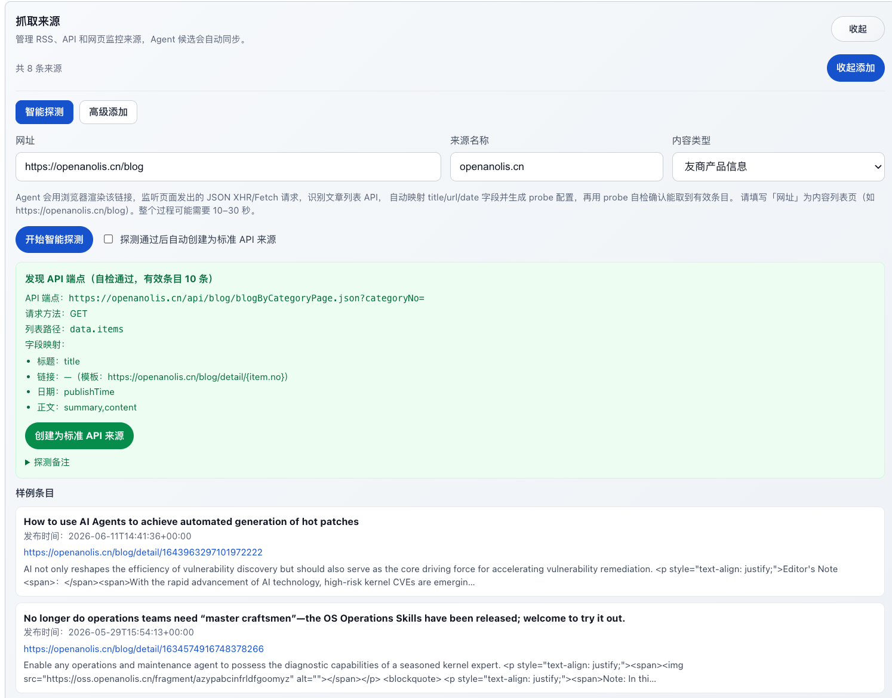
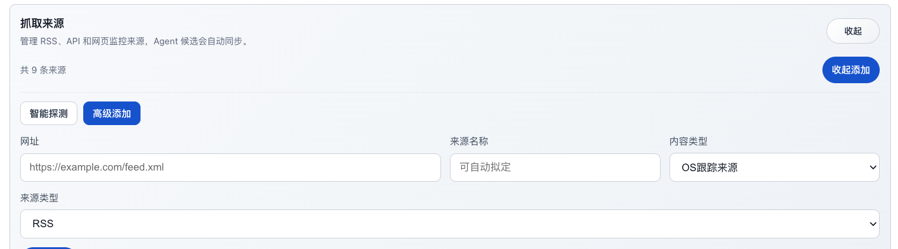
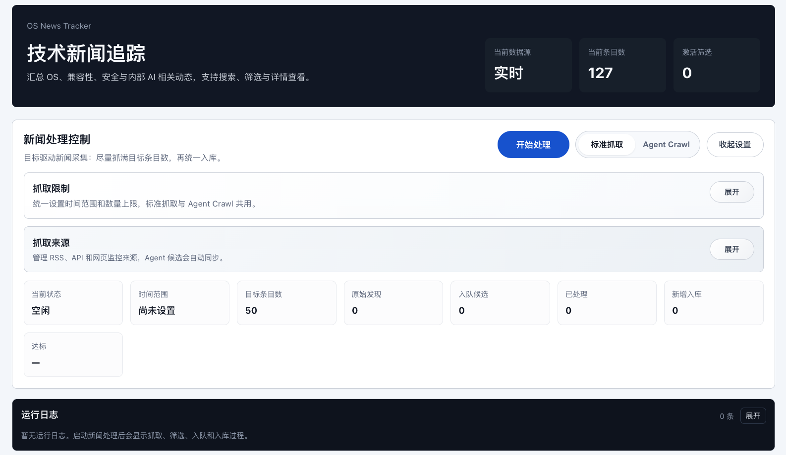
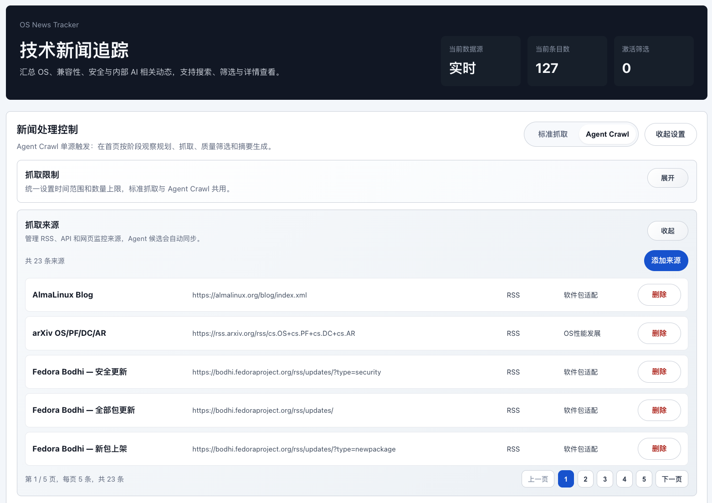
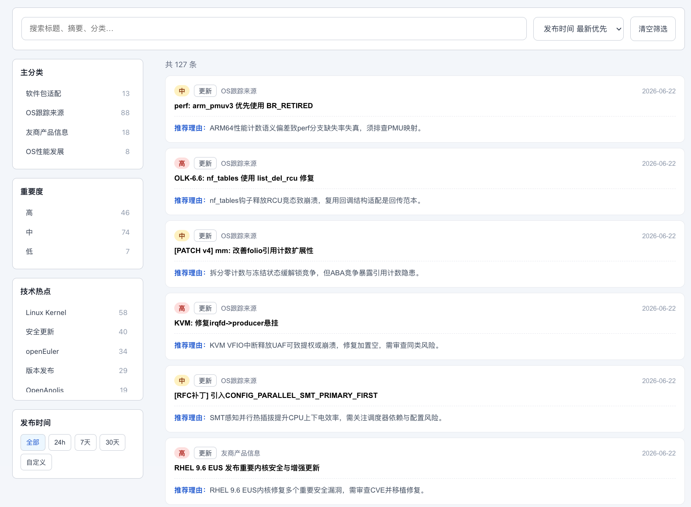
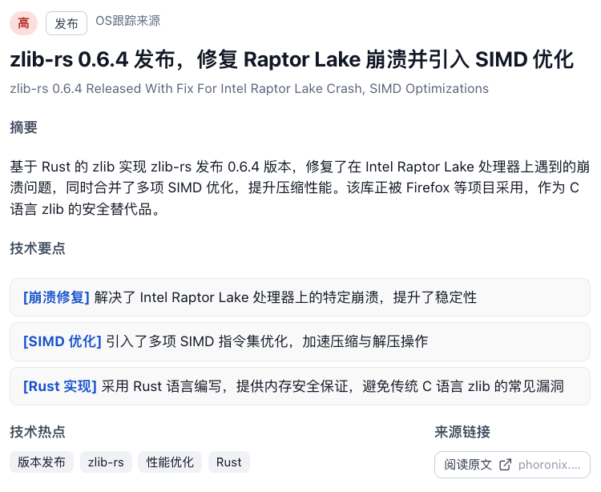
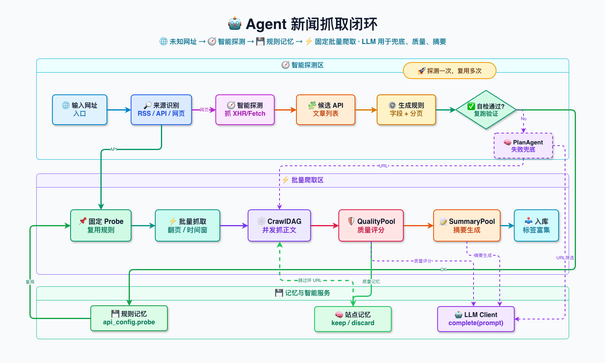
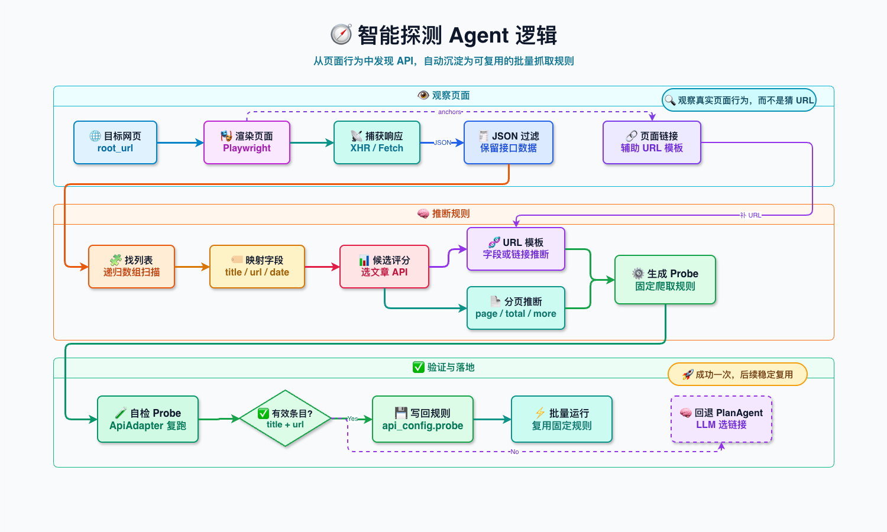
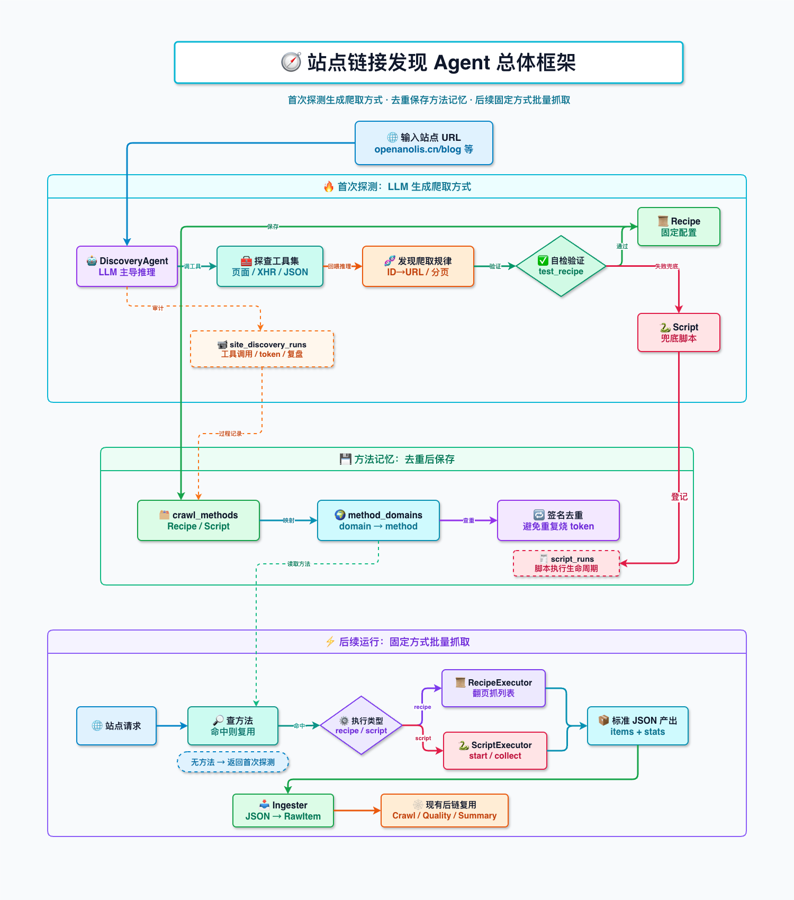

# 新闻跟踪Agent最新进展

## 技术新闻追踪 Agent 系统设计上周部分功能完成情况

### 1.添加了新的爬取方式

目前支持两种爬取方式：RSS和API访问，其中RSS方式可以通过RSSHub来获取更多的新闻源，API访问方式则可以直接访问，拿到请求的json数据来获取相关的数据。

### 2.筛选了新的优质数据源头

目前支持的数据源头有：

| 数据源名称 | URL | 类型 | 分类 |
|---|---|---|---|
| Red Hat AI Blog | https://www.redhat.com/en/rss/blog/channel/red-hat-ai | RSS | OS跟踪来源 |
| Red Hat Blog | https://www.redhat.com/en/rss/blog | RSS | OS跟踪来源 |
| RHEL Blog | https://www.redhat.com/en/rss/blog/channel/red-hat-enterprise-linux | RSS | OS跟踪来源 |
| Ubuntu Blog | https://ubuntu.com/blog/feed | RSS | OS跟踪来源 |
| AlmaLinux Blog | https://almalinux.org/blog/index.xml | RSS | 软件包适配 |
| arXiv OS/PF/DC/AR | https://rss.arxiv.org/rss/cs.OS+cs.PF+cs.DC+cs.AR | RSS | OS性能发展 |
| openanolis.cn | https://openanolis.cn/api/blog/blogByCategoryPage.json?categoryNo= | API | 友商产品信息 |
| openEuler 博客 | https://www.openeuler.org/api-search/search/sort/blog | API | 友商产品信息 |
| Phoronix | https://www.phoronix.com/rss.php | RSS | OS性能发展 |

其中RSS可以进行`手动添加`，API访问则一般需要`智能探测`来进行添加。

### 3.优化了爬取筛选规则和输出格式以及打分规则

3.1 爬取筛选规则
```
你是操作系统维护团队的情报筛选员。判断以下内容是否值得 OS maintainer 关注。
收录标准：版本发布、安全公告、软件包更新、新技术/工具发布、性能数据、AI agent/LLM 工具链进展。
排除标准：纯社区活动通知、招聘、用户入门教程、市场营销、非技术公告。
关键词：{keywords}
标题：{title}
正文片段：{snippet}
只回答 true 或 false。
```

3.2 抓取质量评分


```
你是操作系统维护工程师的技术内容质量评估员。阅读以下页面内容，给出 0–10 的综合质量分，判断它是否值得进入后续摘要提取流程。

只收录对 OS maintainer 有实际价值的技术内容：操作系统、内核、发行版、编译器、包管理器、云原生基础设施的版本发布与重大更新；性能基准测试、架构分析、ABI/API 变更公告；AI agent / LLM 工具链、ML 推理框架的重要发布；跨社区/跨发行版的严重安全漏洞与供应链安全事件；上游项目的技术讨论、设计文档、RFC。
不收录：社区活动通知、线下 meetup、会议征稿、直播预告；招聘信息；用户入门教程、基础配置指南；市场营销材料、产品宣传；非技术性公告、公司财报、人事变动；单纯文档首页、仓库 README、SIG 介绍页、目录索引页；列表页、搜索结果页、登录页；反爬挑战页（"Making sure you're not a bot" / "Anubis" / "Proof-of-Work" / "enable JavaScript"）或正文为空、只有站点导航的页面——这些必须打 0 分，verdict=discard。

## 打分维度（0–10 整数分）

从以下四个维度综合评估，给出 0–10 的总分：

1. **相关性** — 与用户关注领域（见下方）的匹配程度
   - 直接命中（内核版本发布、发行版公告、包管理变更）→ 高
   - 间接相关（通用云原生、AI 工具链，但未涉及 OS 层面）→ 中
   - 无关（招聘、活动、营销）→ 低

2. **信息密度** — 是否包含具体的事实、数据、版本号、技术参数
   - 有明确的版本号、CVE 编号、性能数字、代码片段 → 高
   - 有概括性技术描述但缺乏具体数据 → 中
   - 纯观点、纯介绍、无实质技术内容 → 低

3. **时效价值** — 对当前决策和行动的参考价值
   - 刚发布的新版本、新漏洞、新工具 → 高
   - 持续性跟踪内容（性能数据更新、路线图推进）→ 中
   - 过时信息、历史回顾、基础概念介绍 → 低

4. **可操作性** — OS maintainer 读完后能做什么
   - 可直接指导升级/修复/适配决策 → 高
   - 提供背景知识，辅助长期判断 → 中
   - 读了和没读差别不大 → 低

## 分数区间参考

| 分数 | 含义 | 典型场景 |
|------|------|---------|
| 9–10 | 必读 | 内核大版本发布、严重安全漏洞、关键兼容性变更 |
| 7–8  | 推荐 | 重要包更新、性能报告、技术路线变化 |
| 5–6  | 可读 | 一般技术讨论、小版本更新、观点分析 |
| 3–4  | 边缘 | 通用技术新闻、与 OS 关系不大的工具链 |
| 0–2  | 噪音 | 招聘、活动、营销、反爬页、空页 |

should_remember：特征明显（高信息密度、明确技术主题）→ true；内容模糊难以归类 → false。

用户关注点：{focus_areas}

URL：{url}
标题：{title}
正文片段（前1500字）：
{content_preview}

只输出 JSON，不要多余文字：
{"score": 7, "reason": "包含 Linux 6.12 版本发布的具体变更列表和性能数据", "relevant_topic": "Linux Kernel", "verdict": "keep", "should_remember": true}
```

### 4.优化了爬取速度

| 优化点 | 具体做法 | 效果 |
|---|---|---|
| 多来源并发抓取 | 手动抓取时用 `ThreadPoolExecutor` 并发跑多个 source，默认最多 4 个抓取 worker | 不再一个来源一个来源串行等 |
| 抓取、打分、入库解耦 | 用队列把候选收集、LLM 打分、最终入库拆开处理 | 抓取和处理可以流水线推进 |
| 并行抓正文 | Agent Crawl 的 `CrawlDAG` 用异步并发抓页面，默认 `crawl_workers=5` | 多个 URL 同时抓取 |
| 并行质量评估 | `QualityWorkerPool` 默认 `quality_workers=3` 并发调用 LLM 打分 | 质量筛选不再完全串行 |
| 并行摘要生成 | `SummaryWorkerPool` 默认 `summary_workers=3` 并发生成摘要 | 摘要阶段提速 |
| SiteMemory 缓存 | 已知高质量页面直接通过，已知低质量页面直接丢弃 | 重复页面不再重复调用 LLM |
| API 种子预取 | API 来源已经拿到内容时，跳过页面抓取阶段 | 对 API 型来源减少一次网页抓取 |
| Prompt 截断 | 质量评估只传前 1500 字，摘要只传前 4000 字，富化最多 6000 字 | 降低 token 和响应耗时 |

### 4.添加了链接添加/删除的功能

支持智能探测和高级添加两个功能

#### 4.1智能探测


#### 4.2高级添加


### 5.界面展示

#### 5.1 界面爬取设置总揽





#### 5.2 新闻爬取结果展示





### 7.功能框架图

#### 7.1 Agent 新闻抓取框架



#### 7.2 智能探测Agent执行逻辑框架



#### 7.3 智能探测Agent重构计划框架



#### 6. 未来计划

| 功能模块 | 核心目标 | 完成进度 | 完成情况 |
|---|---|---:|---|
| AI 智能爬取引擎 | 用户可自定义网站，AI 自动规划爬取、质量筛选 | 70% | 已完成基本查询逻辑，需进行框架调整，以及并行信息爬取逻辑 |
| 用户账户系统 | 支持多用户独立使用，邮箱注册登录 | 30% | 已建立数据表，着手完善前后端逻辑 |
| 个性化推荐评分 | 每人可设置自己的关注标准，信息按相关度排序 | 0% | 需等待权限管理完成后进行 |
| 群组订阅体系 | 三级权限管理，按群组共享爬取资源，降低 API 成本 | 0% | 未完成 |
| 新闻趋势总结 | AI 自动分析一段时间内的技术热点与新兴趋势 | 0% | 未完成 |
| 推荐建议 | 根据当前OS和目前最新技术进展，进行选择性推荐与技术建议 | 0% | 未完成 |
| 统计功能 | 加入统计面板，统计各网站的新闻数量、质量平均分数、阅读量以及token相关消耗 | 0% | 未完成 |
| 前端界面优化 | 新设计系统，增加登录、偏好设置、趋势总结等页面 | 0% | 未完成 |

优先级