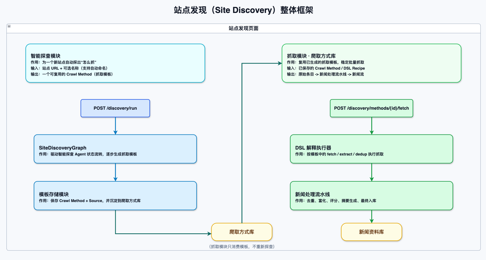
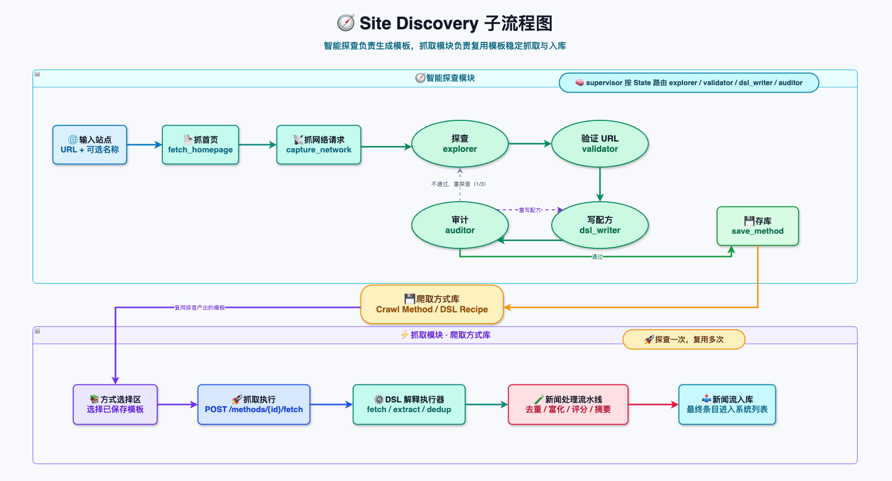
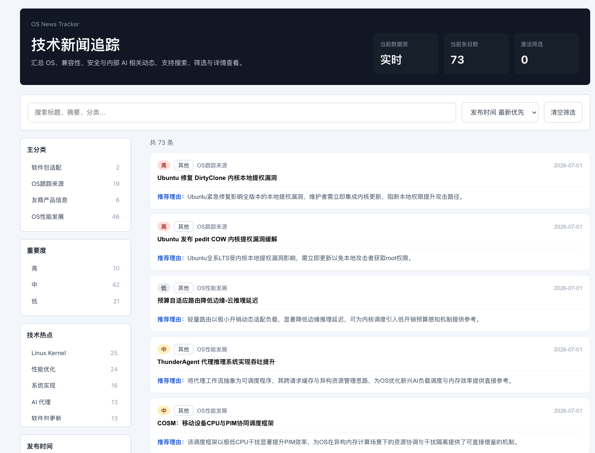
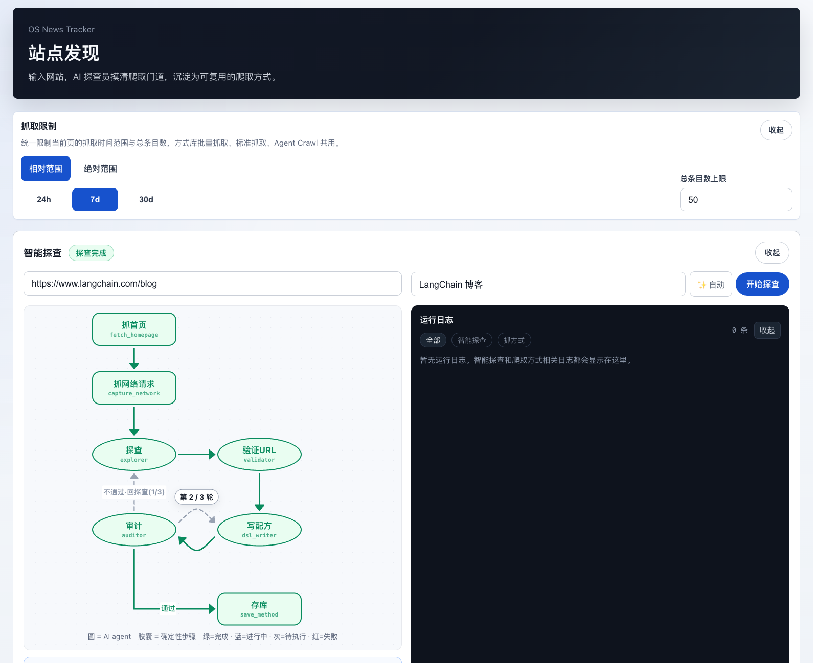

# 新闻跟踪Agent最新进展(2026-07-03)
## 上周暴露的问题
1. 站点子系统核心瓶颈：新站点接入太依赖人工经验，而且这个经验无法稳定复用

以前要接一个新网站，通常要人工去看首页、抓网络请求、猜列表接口、试 URL 规律、写解析逻辑、反复调试。这个过程有几个明显问题：
|问题|具体表现|影响|
|-|-|-|
|结果不稳定、不可复用|即使某次把站点探出来了，方法也常常停留在一次性的临时配置或人工经验里，缺少统一的方法表示、验证流程和沉淀机制；|新站点接入成本持续偏高，已有探查成果难复用，系统无法把“接站经验”沉淀成长期资产|
|稳定性差|真实站点里经常出现特殊链接、非常规参数、分页或跳转逻辑无法直接识别的情况；一次抓取走不通时，需要人工补参数、拆成多阶段查找网页|探查成功率和执行稳定性不高，人工介入频繁，接入流程长且调试成本高|
|拓展性差|一旦要引入新的探查方式、抓取原语或中间步骤，原有流程的输入输出耦合太紧，往往需要联动修改整条链路，而不是局部插拔扩展|新能力接入代价大，系统演进速度慢，后续功能扩展和架构迭代成本持续上升|

2. 前端功能区复杂，查询功能和结果统计耦合在一起

|问题|具体表现|影响|
|-|-|-|
|功能入口混杂|抓取控制、Agent Crawl、来源管理都挤在首页里，新闻浏览和“发现/运营”操作混在一起|首页职责不清，用户心智负担大，页面也更难继续扩展|
|发现过程不可见|就算后端有探测/抓取能力，前端也缺少对“当前跑到哪一步、哪里失败、为什么重试”的直观展示|调试和使用都不透明，出问题时只能靠日志或后端排查|
|结果难管理复用|缺少独立的“爬取方式库”视图，发现出来的方法不能方便地查看、启停、复跑、批量操作|新发现的方法沉淀不下来，复用效率低，仍然偏一次性操作|

## 本周新增的功能

### 站点发现agent（Site Discovery）

让 AI 自动摸清一个网站抓取方法，并沉淀为可复用、可重跑的"爬取方式"（DSL Recipe）。这是从零新增的完整链路。即用一套标准化、可执行的描述格式，来表达某个站点应该怎么抓。

|核心优势|说明|
|-|-|
|降低接入成本|把人工接站流程自动化、标准化，减少每新增一个站点都要单独分析和定制开发的成本|
|提高复用性与稳定性|用 DSL Recipe 沉淀抓取方法，并通过验证/审计形成闭环，避免一次性探查结果难复用、结果不稳定的问题|
|支撑后续规模化扩展|让“新增来源”从手工操作变成系统能力，为后续持续扩源、接入复杂站点和增加探查策略打基础，即加入相关功能的子agent进入网站探查模块或者是抓取模块即可|

### 前端改进

前端这段时间的更新，围绕 “站点发现”这条新工作流的可视化和可操作化。
前端也从原来基本只有“新闻流首页”，变成了 双页面结构：/ 是新闻流，/discover 是站点发现，并加了顶部导航切换。

|更新后的优势|具体说明|
|-|-|
|页面分工更清晰|从原来首页混合多种功能，变成新闻流和站点发现分开的独立页面，操作路径更明确。|
|探查过程更透明|新增流程图、节点详情和日志面板，可以直观看到探查进度、失败位置和重试情况。|
|结果更容易复用|新增爬取方式列表和详情管理，发现出来的方法可以查看、复跑、启停和批量使用。|

### 架构图展示

前端页面展示

## 数据分析与汇总

|查询源|条目数|关键词/主题词（近 30 天）|文章质量分析|网站优先级|最新新闻时间|高/中/低|
|-|-|-|-|-|-|-|
|Phoronix|29|软件包更新, OS性能发展, 系统实现, 性能优化, Stratis, 文件系统, Fedora, Linux Kernel, Chromium, KDE Plasma, KWin, GCC, RISC-V, Rust, Git, WSL, ARM, AMD 等|这是当前库里最强的高频覆盖源，数量远高于其他站点，说明它在“发现新动向”上很有效。问题也同样突出：低档条目非常多，最近内容里既有发行版特性预览，也有桌面图形修复、工具链更新、安装支持之类消息，覆盖广但价值层次波动明显。它的核心价值是“广覆盖雷达”，不是“高信噪比精选源”。如果系统有后置过滤，它非常值得保留；如果直接把原始输出拿来用，噪声会偏大。|高|2026-07-01 06:30 CST|2 / 14 / 13|
|arXiv OS/PF/DC/AR|16|OS性能发展, 方法论, 系统实现, 验证, 应用领域, 性能模型, 高性能计算, 容错, AI 代理, 操作系统语义, 无障碍, 性能优化, LLVM, GCC, 安全更新, 软件包更新|它不是标准新闻源，而是研究/前沿技术观察源。优点是主题面明显变宽，既有系统方法论，也有性能优化、Agent 工作负载、编译优化、机密 AI、软件生态接口审计等内容，说明它对前沿方向扫描是持续有价值的；16 条里没有高档条目，说明它更适合补趋势、补思路、补设计空间，而不是提供必须快速响应的 OS 新闻事件。综合看，它是一个不错的二级源，但不是主线新闻源。|中|2026-07-01 12:00 CST|0 / 8 / 8|
|Ubuntu Blog|5|安全更新, Linux Kernel, OS跟踪来源, Ubuntu, SQLite, 软件包更新, TLA+, dqlite, ARM|这是当前最稳的高质量源之一。虽然总量不大，但近 5 条里有两个内核提权漏洞相关条目，还有 Livepatch、SQLite/dqlite 问题分析、虚拟化 Android 更新，整体上都很像“真正值得看的内容”，而不是泛泛公告。它的高档条目占比高，最新时间也很新，说明这个源同时具备时效性和实用价值。对 OS 情报系统来说，这类源的优势不是量，而是几乎每条都有较强的可读价值和跟进价值。|高|2026-07-01 15:57 CST|3 / 2 / 0|
|RHEL Blog|5|OS跟踪来源, 软件包更新, 系统实现, RISC-V, Linux Kernel, 安全认证, RHEL, Amazon Linux, 容器逃逸, 安全更新|这个源依旧属于企业级 OS 信息里非常稳的一档。条目数量不多，但几乎没有噪声，内容集中在版本能力、迁移、安全、平台兼容性这些真正有决策价值的主题上。它的缺点不是质量，而是更新节奏偏慢，最近一条停在 6 月 16 日，所以爆发力一般；但只论“单条是否值得看”，它还是明显优于很多泛技术媒体。属于低噪声、适合重点保留的核心源。|高|2026-06-16 08:00 CST|2 / 3 / 0|
|linux-magazine|4|Linux Kernel, 性能优化, 文件系统, 友商产品信息, 恶意软件, Arch Linux, AUR, 供应链安全, Alpine Linux, 软件包更新, 安全更新|这个源的特点是能补到一些边缘但不空洞的技术话题，比如 AUR 恶意软件攻击、Alpine Linux 发布、KDE Linux 安全策略变化、Linux 存储性能优化。它不是那种持续输出高优先级事件的站点，但也不是纯凑数信息源。问题在于它目前全部是中档，没有明显高档爆点，所以更像“质量尚可的补充源”，不适合作为核心判断依据。|中|2026-06-23 08:00 CST|0 / 4 / 0|
|openeuler.org|3|AI 代理, 安全更新, openEuler, 系统实现, 方法论, Linux Kernel|这个源数量不大，但和你的业务主题贴合度很高。近三条都围绕 openEuler、AI、漏洞修复、模型部署这类方向，说明它输出的不是泛社区水文，而是和平台能力、AI 基础设施、修复流程相关的内容。短板是样本偏少，而且暂时没有高档条目，所以“方向对”还没有完全转化成“近一个月供给强”。如果你重点盯国产 OS 生态，它依然值得高优先级保留；如果只看本月爆点密度，它还没达到头部水平。|高|2026-06-29 08:00 CST|0 / 3 / 0|
|AlmaLinux Blog|2|容器逃逸, AlmaLinux, 安全更新, Linux Kernel, 安全认证|样本很少，但现有两条质量都不差，其中一条还是高档的容器逃逸漏洞修复，说明它属于典型的低频但一旦更新就可能有价值的源。它不适合承担持续供给任务，但适合作为低频重点监控对象。换句话说，这不是“量产型新闻源”，而是“出一条可能就值得看一眼”的站点。|中|2026-06-30 08:00 CST|1 / 1 / 0|
|Red Hat Blog|2|系统实现, AI 代理, 安全认证, 方法论|这个源更偏集团级技术叙事和方案输出，而不是聚焦 RHEL 主线的 OS 情报源。当前两条内容能看出它有企业技术方向上的价值，但对 OS 新闻主线的支持度明显不如 RHEL Blog。它适合补充方法论背景和大厂方向感，不太适合承担日常新闻抓取的核心角色。近一个月没有高档条目，也说明它对高优先级新闻的贡献有限。|低|2026-06-26 08:00 CST|0 / 2 / 0|
|CachyOS新闻|1|性能优化, GCC, 软件包更新, CachyOS|目前只有一条样本，能说明它在小众发行版和性能优化生态里有一些补充价值，但远不足以证明稳定性。它更像一个边缘观察点，而不是值得重点依赖的主力源。除非你明确需要跟踪 Arch 衍生发行版，否则这个源的优先级不会高。|低|2026-06-28 22:29 CST|0 / 1 / 0|
|https://rockylinux.org/news|1|安全认证, Rocky Linux,|单条样本本身质量不错，而且是高档，主题也和安全启动 CA 过渡这种实际运维问题直接相关，说明这个源不是没价值。问题仍然是样本太少，暂时还看不出它是持续高价值，还是偶尔命中一次。现阶段更适合纳入监控池，而不是给高权重。|中|2026-06-02 08:00 CST|1 / 0 / 0|

## 本周计划
1. 着手完成用户账户系统的设计和实现，争取本周上线
2. 探查模块还需要集中处理一下WAF，cloudfare以及其他反扒网页，需要设计新的工具来绕过或者避免

##  完成进度
|功能模块|核心目标|完成进度|优先级|完成情况|
|-|-|-|-|-|
|AI 智能爬取引擎|用户可自定义网站，AI 自动规划爬取、质量筛选|90%|高|已完成基本查询逻辑，需进行框架调整，以及并行信息爬取逻辑|
|用户账户系统|支持多用户独立使用，邮箱注册登录|30%|中|已建立数据表，着手完善前后端逻辑|
|个性化推荐评分|每人可设置自己的关注标准，信息按相关度排序|0%|中|需等待权限管理完成后进行|
|群组订阅体系|三级权限管理，按群组共享爬取资源，降低 API 成本|0%|高|未完成|
|新闻趋势总结|AI 自动分析一段时间内的技术热点与新兴趋势|0%|高|未完成|
|推荐建议|根据当前OS和目前最新技术进展，进行选择性推荐与技术建议|0%|中|未完成|
|统计功能|加入统计面板，统计各网站的新闻数量、质量平均分数、阅读量以及token相关消耗|0%|中|未完成|
|前端界面优化|新设计系统，增加登录、偏好设置、趋势总结等页面|0%|低|未完成|