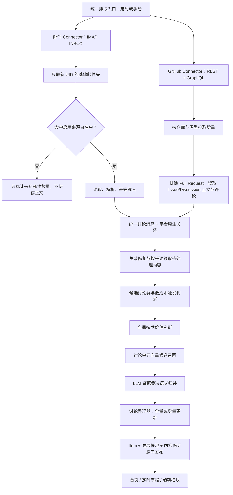

# 技术讨论邮件采集与持续整理全链路设计

> 状态：设计已确认，等待实施
>
> 范围：第一阶段为公开技术邮件列表；第二阶段接入 GitHub Issues 与 GitHub Discussions。Pull Requests、提交和发布信息只作为后续的关联证据入口，不在本设计中作为技术讨论主输入。
>
> 边界：本文只规划功能，不包含代码实现

## 1. 目标

将公开技术邮件列表和 GitHub 原生讨论流中的持续对话整理为可更新的“技术讨论条目”。技术讨论条目与新闻共用 `items` 内容入口和首页列表，复用标题、摘要、分类、标签、信息类型、重要性、发布时间、筛选、推送和趋势分析能力；同时保留完整消息群、平台原生关系、主要观点、分歧、结论变化和讨论进展。

一个技术讨论条目的体量应与一条新闻相当。邮件内部可以包含一棵或多棵语义相关的回复树，但不能无限聚合为长期大主题。跨技术讨论条目的长期趋势仍由现有趋势模块负责。

核心目标：

- 每天从专用 Gmail 的 INBOX 和已启用 GitHub 仓库增量读取一次，并支持手动触发。
- 由系统自己的正向来源白名单识别邮件，不依赖 Gmail Label 或 Gmail 过滤器。
- 保留并展示平台真实讨论关系：邮件使用 `Message-ID`、`In-Reply-To` 和 `References`；GitHub Discussions 使用评论与回复 ID；GitHub Issues 以 Issue 为根、评论为同级消息，不虚构评论间回复边。
- 将实质技术讨论提升为 Item；纯补丁流、机器人通知和低价值对话不进入首页。
- 新回复到达后更新原 Item，而不是创建重复条目。
- 保留每轮讨论进展快照，并向现有趋势模块发布同一 Item 的新内容修订。
- 首页、定时简报和趋势分析都能看到技术讨论的最新全貌。

## 2. 非目标

第一阶段明确不做：

- 不自动向外部邮件列表订阅或退订；订阅仍由管理员在社区侧完成。
- 不访问 lore、Mailman、Pipermail 等公开归档自动补齐缺失祖先。
- 不保存原始 `.eml`、原始 HTML 或二进制附件。
- 不建设补丁追踪器，不跟踪补丁版本、`Reviewed-by`、`Acked-by`、`Nacked-by` 或 `Applied` 状态。
- 不把向量相似度直接作为语义归并结论。
- 不把多个技术讨论条目直接合并为长期趋势；该职责属于现有趋势模块。
- 第一阶段不接入 GitHub；第二阶段只接入 GitHub Issues 与 GitHub Discussions。Pull Requests、Commits、Release 和外部设计文档不作为讨论主输入，后续可作为关联证据补充。
- 不修改冻结的 Agent Crawl 逻辑。

纯补丁发布、diff、版本重发、机器人测试和机械式评审不提升为 Item；但补丁回复中如果形成架构取舍、性能影响、回归原因、兼容性风险、接口设计或替代方案等实质技术讨论，可以作为技术讨论收录。摘要只关注技术议题，不汇报补丁版本进度。

## 3. 统一术语与边界

### 3.1 统一讨论消息 Discussion Message

一条可供讨论整理器处理的最小公开内容单元。它具有稳定的 `provider + external_id`、作者、发布时间、更新时间、正文、公开 URL、所属来源和平台原生父关系。所有 Connector 都先转换到此内部表示，再进入候选、价值判断、整理和 Item 修订；调用方不需要了解 IMAP、REST 或 GraphQL 的分页和游标差异。

统一表示不抹平平台语义：邮件消息可以有确定性父邮件；GitHub Discussion 的回复可以有确定性父评论；GitHub Issue 评论没有“回复某条评论”的官方关系，只关联所属 Issue，必须保持扁平。

### 3.2 邮件消息 Mail Message

一封通过来源白名单的邮件。邮件以规范化后的 `Message-ID` 全局唯一，保存必要邮件头、清洗后的完整纯文本正文和本封新增内容。

### 3.3 回复树 Thread

由一个当前可见根消息及其全部后代组成。Thread 的父子关系只能来自 `In-Reply-To` 和 `References`，不得根据 Subject 或向量相似度伪造。

缺少祖先时，以当前已收到的最早消息作为临时根建树，并标记上下文不完整。未来如果缺失祖先通过正常采集或手动导入进入系统，系统自动重挂父子关系、重新计算根节点，并在必要时合并原来的临时 Thread。

### 3.4 讨论群 Discussion Group

一条可展示的技术讨论事实单元，对应一个 Item。一个讨论群可以包含：

- 一棵确定性回复树；或
- 多棵没有共同 Message-ID 祖先、但经向量召回和 LLM 证据判断属于同一具体技术讨论的回复树。

语义归并只把多个平台原生讨论单元放进同一讨论群，不改写邮件、GitHub Discussion 或 GitHub Issue 的原生关系。

### 3.5 技术讨论 Item

通过全局价值判断的讨论群映射为一条 `item_kind = discussion` 的 Item。Item ID 稳定；新消息只增加内容修订，不创建新 Item。

### 3.6 趋势 Trend

趋势是由现有趋势模块负责的跨 Item 分析结果。新闻 Item 和技术讨论 Item 都是趋势模块的事实输入。本文中的“讨论进展”不得命名为“趋势”，避免与全局趋势概念混淆。

## 4. 来源范围与阶段

### 4.1 第一阶段：邮件列表一次性接入

第一阶段规划接入：

- LKML
- netdev
- linux-mm
- linux-block
- linux-fsdevel
- KVM
- BPF
- glibc 相关开发讨论列表
- GCC 相关技术讨论列表
- QEMU 开发讨论列表
- OpenSSH 开发讨论列表
- OpenSSL 当前公开讨论列表或 Google Group 邮件投递

所有来源通过数据库配置识别规则，不在代码中硬编码来源名称、域名或列表地址。实际 `List-Id`、`List-Post` 和投递地址在完成外部订阅后，通过管理界面的邮件头测试确认。

来源入口和项目协作方式的现状依据见 [开发邮件列表实时订阅入口调研](research/开发邮件列表实时订阅入口调研.md)。

### 4.2 第二阶段：GitHub 原生讨论流

第二阶段规划：

- containerd、runc、systemd 等 GitHub 驱动项目优先使用原生 API，而不是伪装成邮件列表。
- GitHub Issues 和 GitHub Discussions 都是候选讨论入口，不因来自 GitHub 就直接提升为 Item。
- GitHub Discussions 使用 `discussion_id`、`comment_id` 和 `reply_to_id` 建树；Issue 使用 `issue_id` 为根、Issue 评论为同级子消息，并保留状态、标签、关闭时间和关联 URL 作为事件证据。
- Issue 与 Pull Request 在 GitHub REST 返回中可能混合；本阶段必须以 `is:issue` 和 `pull_request` 字段双重排除 Pull Request。
- GitHub 保留平台用户 ID、公开 URL、创建/更新时间和平台原生关联；公开 URL 是详情“前往 GitHub”的可靠外链。
- 第二阶段复用邮件阶段的讨论群 Item、结构化整理、内容修订、抽屉和拓扑展示能力，但使用独立 GitHub Connector 和增量水位。

GitHub 接入不得拖慢第一阶段邮件核心能力上线。

### 4.3 GitHub 仓库来源配置

每个 GitHub 来源是一个仓库配置，而不是一个全局关键字搜索。配置至少包含：

- `owner/repo`、启用状态和展示名称；
- 是否收取 Issues、是否收取 Discussions；
- Issue 的标签白名单/黑名单、状态范围和首次回填时间窗；
- Discussion 的分类白名单/黑名单和首次回填时间窗；
- 单仓库的增量水位、最近成功时间、失败信息和限流退避状态。

仓库配置只限定候选范围，不承担“技术讨论价值”的判断。首次接入需要先展示按时间窗预估的 Issue、Discussion、评论和回复数量；管理员确认后才开始历史回填。

## 5. 总体架构



采集接收与来源处理是两层独立语义：

- 邮箱接收层每次统一扫描 INBOX 新 UID，对所有启用来源做白名单识别并可靠入库，成功后推进邮箱级 UID 游标。
- 用户手动选择某个来源时，只限制后续建组、价值判断、归并、LLM 整理和 Item 更新；同期其他来源的邮件已经安全入库，但保持待处理。

这样既不会因 Gmail 全局 UID 游标漏邮件，也不会让一次单来源手动处理触发其他来源的 LLM 成本。

GitHub Connector 是独立的深模块：其接口只产出“本轮已稳定写入的统一讨论消息、关系变化、增量统计和下一水位”，内部自行处理 REST/GraphQL 请求、分页、限流、重试、历史时间窗切片及 REST 与 GraphQL 的结果去重。候选、价值判断、归并和整理模块不感知 GitHub 的传输细节，因此后续新增仓库或改用 Webhook 不会改变下游流程。

## 6. Gmail 与来源识别

### 6.1 邮箱连接

- 使用一个专用 Gmail 账号，只读取 `INBOX`。
- 不读取 Spam、Trash、Sent、Drafts 或 All Mail。
- 不移动、不删除、不归档、不标记已读，不改变邮箱状态。
- 首版使用 IMAP 和应用专用密码；邮箱读取封装为通用接口，未来可替换 OAuth 或其他邮箱。
- Gmail 用户名、应用专用密码只通过环境变量或密钥系统注入，不进入数据库、文档、日志或 Git。
- 任何曾在聊天、日志或其他明文位置暴露的应用专用密码都必须先撤销并重新生成。

建议的配置名仅表示契约，不代表本阶段修改代码：

```text
DISCUSSION_IMAP_HOST=imap.googlemail.com
DISCUSSION_IMAP_PORT=993
DISCUSSION_IMAP_USERNAME=...
DISCUSSION_IMAP_PASSWORD=...
DISCUSSION_IMAP_FOLDER=INBOX
```

### 6.2 一套连接，多条来源

Gmail 连接负责认证、文件夹、`UIDVALIDITY` 和邮箱级 UID 游标。LKML、linux-mm、GCC 等每个邮件列表各自作为独立来源，支持：

- 独立启停；
- 独立筛选；
- 独立任务状态与日志；
- 独立来源健康信息；
- 一次连接后按规则分发。

### 6.3 正向白名单

系统不维护 Google 通知、广告或未知邮件黑名单，也不依赖 Gmail 过滤器。每条来源在数据库中配置可组合的正向识别规则：

- `List-Id`；
- `List-Post`；
- 投递地址；
- 必要时的其他稳定邮件头。

处理原则：

1. 先仅读取新邮件的基础邮件头。
2. 只有命中至少一条启用来源规则，才读取并保存正文。
3. 未命中邮件只累计“未知邮件跳过数”，不保存标题、作者、正文或附件。
4. 多条来源同时命中时允许多来源关联，不按规则顺序抢占。
5. 修改规则只影响后续采集；历史重新识别必须手动触发并显示预计处理数量。

管理界面支持新增、编辑、禁用和测试来源规则。测试结果展示命中数、未命中数、规则冲突数和有限的邮件头示例，不保存未知邮件正文。

## 7. IMAP 增量与幂等

邮箱游标由 `UIDVALIDITY + last_uid` 组成：

- `UIDVALIDITY` 未变化时，只读取 `last_uid` 之后的新消息。
- 数据库成功提交匹配邮件后才推进 `last_uid`。
- `UIDVALIDITY` 变化时进入受控重扫，依靠 Message-ID 和内容哈希幂等去重。
- 不以 `UNSEEN` 作为采集条件，避免用户阅读状态影响采集。
- 同一个 Message-ID 重复投递到多个列表时只保存一条消息实体，但记录多个来源关系。
- 同一 Message-ID 内容冲突时保留首次有效内容和冲突审计，不静默覆盖。

邮箱接收成功但后续 LLM 整理失败时，不回退 UID 游标，也不重复读取成功邮件。

### 7.1 GitHub 历史回填

GitHub 的首次回填与邮件全量重扫的目标相同：可靠建出候选讨论，而不是把某次时间窗内的所有条目直接发布。

- **Issues**：使用 REST `GET /search/issues`，查询固定为 `repo:OWNER/REPO is:issue created:START..END`，按创建时间正序分页。时间范围必须按日或周切片，避免 Search API 单次最多 1,000 条的结果上限；每个 Issue 再读取正文、标签、状态和全部评论。
- **Discussions**：使用 GraphQL `repository.discussions` 按创建或更新时间分页，读取 Discussion 正文、分类、评论和评论回复。GraphQL 连接游标只用于传输分页，不能替代数据库持久化的业务水位。
- 历史回填的结束边界按 UTC 处理；界面输入的本地日期必须转换为明确的 UTC 起止时间，避免边界日重复或遗漏。
- 以 GitHub `node_id`/数值 ID 作为幂等键，以公开 URL 辅助审计；不以标题、作者或正文哈希判断是否同一条 GitHub 内容。
- 历史回填先持久化消息和原生关系，再按当前筛选范围进入统一的候选与整理队列。中断后从已提交的页和水位继续，不重新消耗已成功页面。

### 7.2 GitHub 持续增量与一致性

GitHub 没有邮件 UID 语义，增量以“更新时间水位 + 稳定 ID”实现，并保留小幅重叠窗口：

1. Issue 使用 `GET /repos/{owner}/{repo}/issues?state=all&sort=updated&direction=asc&since=...` 获取更新候选；即使已使用 `is:issue` 回填，也要再次过滤响应中的 `pull_request` 字段。
2. 对候选 Issue 读取详情与评论；另以仓库级 Issue 评论增量接口补偿评论编辑和延迟可见性。两条路径按 `comment_id` 幂等合并。
3. Discussion 使用 GraphQL 按 `UPDATED_AT` 递增扫描；发现 Discussion 更新后，重新读取其评论和回复页，直到页游标结束。
4. 任务成功后才推进仓库级水位。水位保存 `updated_at + external_id`，相同时间戳按 ID 稳定排序；下一轮从“水位减去重叠窗口”开始，数据库幂等去重。
5. 限流、权限不足、单页失败或返回不完整结果都不推进对应范围的水位；记录可重试范围和 GitHub 请求 ID。一个仓库失败不阻塞邮件或其他仓库。

Issue 的 `updated_at`、标签、打开/关闭状态和评论变化都是有价值的讨论进展，但不等价于“新增技术观点”。只有新增或编辑后的实质正文通过后续筛选时，才生成 Item 修订和进展快照。

### 7.3 GitHub Discussions、Issues 与邮件关系语义

| 上游载体 | 根节点 | 可确定的回复边 | 拓扑展示 | 适合提炼的内容 |
| --- | --- | --- | --- | --- |
| 邮件列表 | 根邮件 | `In-Reply-To` / `References` | 有向回复树，可存在缺失祖先 | 设计取舍、维护者讨论、长期技术争议 |
| GitHub Discussion | Discussion | 评论 → `replyTo` 评论 | 有向回复树 | 方案征询、生态经验、路线与开放讨论 |
| GitHub Issue | Issue | Issue → 评论；评论之间无官方回复边 | 一层星形/时间序列，不伪造子回复 | 缺陷根因、接口/兼容性取舍、被明确讨论的功能设计 |

同一项目中的邮件 Thread、GitHub Issue 和 GitHub Discussion 可以经证据裁决归入一个 Discussion Group，例如 Issue 明确链接到某邮件讨论或 Discussion 延续同一具体设计问题；仅标题相似、同一仓库、同一标签或相同作者都不足以合并。跨平台归并必须记录各平台 URL、证据片段和裁决理由。

## 8. 邮件解析与数据库内容

### 8.1 保存内容

所有持久化数据只进入 PostgreSQL，不使用文件存储或对象存储。

通过来源白名单后的邮件保存：

- Message-ID、In-Reply-To、References；
- 来源列表关联；
- Subject、作者显示名、标准化作者邮箱、发送时间；
- `body_text`：解码、HTML 转纯文本后的完整正文，保留引用；
- `authored_text`：尽量只保留本封邮件新增内容；
- 内联技术文本；
- 文本型 `.patch`、`.diff`、`.txt` 附件的有限内容与元数据；
- 二进制附件的名称、类型和大小，不保存内容；
- 内容哈希、解析状态、解析器版本；
- IMAP UID、UIDVALIDITY 和接收批次。

不保存：

- 原始 RFC822 `.eml`；
- 原始 HTML；
- 图片、压缩包、可执行文件等二进制附件；
- 未命中来源白名单的邮件正文。

Gmail 邮件不自动删除，作为上游原始缓冲。解析器升级后，如原邮件仍在 Gmail，可按 IMAP 定位信息重新读取；否则只能基于已保存的标准化正文重算。

### 8.3 GitHub 内容标准化

GitHub Connector 只保存公开可访问且配置范围内的内容，不抓取通知流、用户私信或仓库外的搜索结果。Issue 与 Discussion 的根正文、评论、回复分别保存为统一讨论消息，并保留：

- provider、仓库、稳定外部 ID、父外部 ID、公开 URL；
- 标题（根节点）、作者登录名和平台用户 ID、创建时间、更新时间；
- 清洗后的 Markdown 纯文本与原始文本哈希；
- Issue 的状态、关闭原因、标签、里程碑和关联 Issue/Discussion URL；
- Discussion 的分类、锁定状态、回答/已解决状态（平台提供时）和评论回复关系；
- 拉取批次、Connector 版本、最后观察时间与删除/权限不可见状态。

不保存用户头像、反应明细、通知订阅关系或 GitHub Token。正文中的外链只作为文本证据，不自动继续抓取。内容被编辑时保留最新标准化正文和版本审计；内容删除、转私有或当前凭据无权访问时，不物理删除既有审计和已发布 Item，而是标记为“上游不可见”，后续整理不得引用已经不可访问的新内容。

### 8.2 MIME 与正文规则

- 正确处理 multipart、字符集、Base64、quoted-printable、折行邮件头和编码 Subject。
- HTML 只转安全纯文本，不加载远程图片、脚本或追踪资源。
- `body_text` 保留引用，保证以后可以重新生成 `authored_text`。
- `authored_text` 用于 LLM，减少祖先正文在每封回复中重复输入。
- 无法可靠区分普通引用、代码、日志或 diff 时宁可保留，不静默删除。
- 单封邮件、正文和文本附件设置大小上限；超限标记并继续整轮任务。

## 9. 回复树构建与修复

### 9.1 父子关系

父子关系按以下优先级恢复：

1. `In-Reply-To` 确定直接父消息；
2. `References` 补充祖先链和缺失关系；
3. 不根据 Subject、作者、时间或向量相似度生成父子边。

### 9.2 临时根

祖先不存在时：

- 不访问外部归档回填；
- 以当前可见最早邮件作为临时根；
- 保留缺失父 Message-ID；
- 标记 `context_incomplete = true`；
- LLM 输入明确说明上下文不完整，不得把临时根断言为真正发起邮件。

### 9.3 自动修复

未来收到缺失祖先后：

- 自动重挂父子关系；
- 重新计算根节点；
- 如果祖先连接了两个临时 Thread，按确定性关系合并；
- 重新计算邮件群统计并触发内容整理；
- 保存修复审计。

## 10. 候选讨论群与提升为 Item

通过邮件来源白名单或 GitHub 仓库范围的有效消息都会保存并建组，但不会全部进入首页。

### 10.1 低成本触发条件

满足以下任一条件时，候选讨论群进入 LLM 全局价值判断：

- 根邮件本身是内容完整的技术问题、设计提案或技术分析；
- 已出现至少两封有实质新增内容的邮件；
- 已有至少两位真实参与者；
- 后续新消息使此前未提升的讨论群出现明显技术讨论。

纯 diff、机器人回复、投递错误、礼貌确认和极短无信息内容不计入实质消息。GitHub 上的自动化 issue 模板、重复报错、版本追踪、单纯“请修复/已修复”往返、CI 机器人和支持问答同样不计入。尚未达到条件的讨论群继续等待，不永久拒绝。

### 10.2 全局事实层判断

是否提升为 Item 与个人身份模板无关。判断关注：

- 是否存在具体技术议题；
- 是否包含架构、性能、安全、兼容性、接口、缺陷或工程取舍等实质内容；
- 是否出现可提炼的观点、分歧、结论或持续跟踪价值；
- 是否排除了纯机器人、营销、政策解读、纯补丁流和无实质内容。

未提升讨论群保留为候选，新消息到达后可以重新判断。一旦提升为 Item，后续不自动退回候选；误收录由管理员隐藏。

## 11. 多个原生讨论单元的语义归并

### 11.1 两种归并必须分开

确定性归并：新祖先证明多个临时 Thread 实际属于同一回复树，系统自动修复 Message-ID 树。

语义归并：多棵没有共同祖先的邮件/Discussion 回复树，或多个围绕同一具体议题的 GitHub Issue，归入同一 Discussion Group Item，但各自根节点和原生关系保持不变。

### 11.2 候选召回与裁决

每轮处理完新增或变化 Thread 后：

1. 为 Thread 生成不包含来源名和参与人数偏见的结构化事实文本。
2. 使用当前统一 Embedding 版本生成向量。
3. 在可配置时间窗口内召回少量已有技术讨论 Item。
4. 向量只提供候选，不直接合并。
5. LLM 比较具体问题、技术对象、方案、原因、结果和证据，只允许：
   - 归入某个已有 Item；
   - 创建新 Item；
   - 证据不足，暂不归并。
6. 仅因同属 Linux、内存、网络、虚拟化等宽泛主题不得合并。

`discussion_merge_window_days` 为全局管理员设置，默认 90 天，可选范围 7～365 天，界面提供 30、60、90、180、365 天预设或受限数字输入。修改只影响后续召回，不自动重算历史。历史重算使用独立手动任务，并在启动前显示预计处理数量。

### 11.3 已发布 Item 的逻辑归并

两个已展示 Item 后来确认应合并时：

- 较早创建的 Item 默认作为主 Item；
- 将另一个 Item 的 Thread 迁移到主 Item；
- 被合并 Item 不物理删除，标记 `merged` 并记录 `merged_into_item_id`；
- 旧链接自动解析到主 Item；
- 保存归并前后 ID、证据、模型版本、阈值、窗口、置信度和时间；
- 主 Item 重新生成总结、统计和向量；
- 管理员可以撤销误归并。

## 12. 独立讨论整理器

技术讨论整理器不复用新闻 Enricher Prompt，但复用现有 LLM 客户端、模型配置、超时、重试和 JSON 校验基础设施。它只接收统一讨论消息，不根据载体类型改变技术价值标准。

讨论整理器负责：

- 全局价值判断；
- 结构化讨论事实生成；
- 新回复增量更新；
- 讨论状态判断；
- 证据 Message-ID 校验；
- Item 通用字段映射。

### 12.1 固定结构化结果

每次成功整理至少输出：

```json
{
  "canonical_title": "稳定的中文技术议题标题",
  "topic_summary": "当前讨论的核心问题",
  "latest_progress": "本轮新邮件带来的实质变化",
  "key_viewpoints": [
    {
      "viewpoint": "主要技术观点",
      "evidence_message_keys": ["mail:<message-id>"]
    }
  ],
  "agreements": ["已一致认可的内容"],
  "disagreements": ["仍存在的关键分歧"],
  "open_questions": ["尚未解决的问题"],
  "current_conclusion": "当前可由邮件证明的结论；没有则明确说明尚无结论",
  "resolution_status": "exploring",
  "importance": "medium",
  "importance_reason": "重要性依据",
  "main_category": "主分类",
  "tags": ["标签"],
  "info_type": "信息类型",
  "why_it_matters": "对 OS 技术趋势的意义",
  "confidence": 0.8,
  "key_message_keys": ["mail:<message-id>"]
}
```

约束：

- 只能依据当前 Discussion Group 数据库内容；
- 不得补充外部事实；
- 关键观点、分歧和结论必须引用当前讨论群真实消息键：邮件为 `mail:<Message-ID>`，GitHub 为 `github:<node_id>`；
- ID、时间、消息数、参与人数、来源和数值热度由系统生成，LLM 无权修改；
- 首次可以生成规范标题，日常更新默认不得改标题。

### 12.2 标题稳定性

首次提升时生成稳定的技术议题标题，不直接照抄 `[PATCH v3 2/7]` 等 Subject。日常新回复只更新摘要、最新进展、状态、重要性和活动时间。

只有以下情况允许改名：

- 临时根补齐后证明原理解错误；
- 多棵树逻辑归并后旧标题不能覆盖整体议题；
- 技术议题发生实质扩展且模型给出证据；
- 管理员手动修改。

改名保留旧标题和原因，不创建新 Item。管理员可锁定标题不再被自动改写。

### 12.3 全量与增量整理

- 邮件群较小时，输入全部 `authored_text` 重新整理。
- 超出模型上下文预算后，输入上一版结构化结果、本轮新增有效内容、根消息、历史关键证据、回复拓扑和参与者变化。
- 本轮新增内容过长时，先按分支或时间分块提取事实，再汇总。
- 每隔若干次更新、Prompt 版本升级或管理员手动触发时，基于数据库正文执行分层重建，修正增量漂移。
- 上下文预算按模型配置，不在业务逻辑中写死字符数。
- 所有截断、分块和证据选择均记录到整理运行中。

### 12.4 失败处理

服务超时、限流、上下文超限、非法 JSON、字段缺失、枚举错误或引用不存在的消息键都属于整理失败。

- 每个讨论群最多自动尝试 3 次。
- 校验失败时将具体错误反馈给下一次重试。
- 3 次仍失败则记录原因和可重试状态。
- 不覆盖上一版正确 Item。
- 新消息继续保存在数据库，Item 标记“有新内容待整理”。
- 单个讨论群失败不阻塞其他讨论群。

## 13. 状态、重要性与热度

### 13.1 活跃状态

- `active`：默认，近期存在新实质消息。
- `quiet`：全局默认 7 天没有更晚的实质消息。

阈值为全局配置，首版不提供每来源阈值。依据上游实际发布时间（邮件 `sent_at`、GitHub `created_at` 或被确认有实质变化的编辑时间），不是系统采集时间。迟到但发布时间更早的内容不重新激活；新实质消息恢复为 `active`。

### 13.2 讨论结果

- `exploring`：提出问题、交换事实或探索方案。
- `diverging`：存在明确分歧，尚未收敛。
- `converging`：主要观点逐渐收敛，但结论仍可能变化。
- `concluded`：形成可由邮件内容证明的明确结论或共识。
- `unresolved`：讨论已平静但没有明确结论。
- `unclear`：上下文不足，无法判断。

讨论结果与活跃状态分别存储并组合展示，例如“存在分歧 · 活跃”“尚无结论 · 已平静”。新回复可以重新判断已形成的结论。

### 13.3 重要性

重要性沿用高、中、低：

- 高：对 OS 核心行为、安全、兼容性、性能或大规模部署有明确影响，且已有可信技术证据和较清晰落地方向。
- 中：有研究或工程价值，但方案仍早期、影响未证明，或缺少实现、上游支持、主流部署和可复现实测。
- 低：范围较窄、证据有限或仅是早期技术疑问。

参与人数、邮件数量或知名维护者参与都不能单独把重要性判高。研究方向默认不判高，出现明确产品落地、上游支持、主流部署或可复现实测后才升级。

### 13.4 讨论热度

热度与重要性分开，使用版本化的确定性公式计算 `0–100` 分。信号包括：

- 最近一次实质消息距今时间；
- 本轮新增实质回复数；
- 本轮新增真实参与者数；
- 是否跨多个邮件列表扩散；
- 是否出现新的分歧、收敛或结论变化。

数量采用 `log1p` 或封顶，纯引用、重复邮件、机器人消息和礼貌回复不增加热度。热度随时间衰减；LLM 只输出是否发生实质状态变化，最终数值由系统计算。

## 14. 时间、排序与本轮新增

技术讨论 Item 使用三个时间：

- `published_at`：当前最早已知根消息的上游发布时间（邮件发送时间或 GitHub 创建时间），不随新消息变化。
- `last_activity_at`：最新实质消息的上游发布时间或被确认有实质变化的编辑时间。
- `updated_at`：系统最后一次成功发布整理结果的时间。

新增统一“最近活动”排序：

- 新闻使用新闻发布时间；
- 技术讨论使用 `last_activity_at`。

首页混排可默认使用最近活动，使旧讨论出现新进展后重新浮到前面；原发布时间和入库时间排序继续保留。卡片同时显示发起时间和最后活跃时间。

“本轮新增 X 条”指当前这次成功采集和整理相对上一次成功整理新增的消息数，不是个人未读数。邮件页面可显示为“封”，GitHub 页面显示为“条”。整理失败时不得错误归零。

## 15. 讨论进展快照与内容修订

Item 保存当前完整全貌。每次存在实质新增或实质编辑内容并成功整理时，数据库追加一条轻量进展快照：

- 整理时间；
- 本轮新增消息键；
- 本轮新增回复/评论数；
- 本轮变化摘要；
- 整理后的活跃状态和讨论结果；
- 关键证据消息键；
- Prompt、模型、解析器和热度公式版本。

没有新增或实质编辑内容时不创建快照。快照不是新 Item，不在首页重复出现，也不作为独立趋势证据。

每次成功发布结构化结果时，Item 的 `content_revision` 加 1：

- Item ID 保持稳定；
- 趋势解释卡和向量标记需要更新；
- 趋势模块当前计算只使用最新修订；
- 旧修订不作为第二条独立事实；
- 已发布趋势快照记录当时引用的 `item_id + content_revision`；
- 只有采集成功但整理失败时，不增加内容修订。

## 16. 建议数据模型

以下为逻辑模型，实施时根据现有模型命名和约束落地。

### 16.1 `items` 扩展

- `item_kind`: `news | discussion`
- `url`、`url_hash`: discussion 允许为空；新闻仍保持必填语义
- `last_activity_at`: discussion 的最新实质消息时间
- `content_revision`: 当前稳定内容修订，默认 1
- `heat_score`: discussion 确定性热度

Discussion 没有可靠公开 URL 时隐藏“阅读原文”，改为打开系统抽屉。某封消息自身包含可靠公开归档链接时，可以记录消息级 `public_url`，但不得根据 Message-ID 猜 HTML 地址。

### 16.2 邮箱与来源

`discussion_mailbox_connections`：

- 连接名、Provider、Host、Port、Folder；
- 用户名环境变量键、密码环境变量键；
- UIDVALIDITY、last_uid；
- 最近成功时间、状态和错误信息。

`discussion_source_rules`：

- source_id；
- 规则类型、匹配值、启用状态；
- 创建与更新时间；
- 规则变更审计。

凭据值本身不进入数据库。

### 16.3 消息与来源关系

`discussion_messages`：

- provider、外部消息 ID、外部父消息 ID、公开 URL；
- 邮件的 Message-ID、In-Reply-To、References；
- Subject、作者名、标准化作者邮箱、sent_at；
- body_text、authored_text；
- content_hash、parser_version、parse_status；
- context_incomplete、body_purged_at；
- UIDVALIDITY、UID、接收批次。

邮件字段只适用于 `provider = mail`。GitHub 消息使用同一张表或等价的 `discussion_platform_messages` 扩展表保存仓库、Issue/Discussion 根 ID、评论/回复 ID、`created_at`、`updated_at`、分类、标签和状态；两种实现都必须保证 `(provider, external_id)` 唯一。不得把 GitHub ID 格式改写成 Message-ID。

`discussion_message_sources`：一条统一讨论消息与一个或多个来源的多对多关系。

参与者首版按小写邮箱地址去重。首页只显示人数；详情节点显示作者名，点击后可查看原邮件中的邮箱。LLM 输入优先使用匿名参与者 ID 和显示名，不用邮箱地址做价值判断。

GitHub 参与者按 `provider + platform_user_id` 去重；跨邮件与 GitHub 不尝试自动识别同一真人。详情页只显示公开登录名，不把邮件地址和 GitHub 身份强行关联。

### 16.3.1 GitHub 仓库与同步状态

`discussion_github_repositories`：

- owner、repo、展示名称、启用状态；
- 收取 Issues/Discussions 开关、标签与分类范围、首次回填窗口；
- Issue 与 Discussion 各自的 `updated_at + external_id` 水位；
- 最近成功时间、失败范围、限流退避、Connector 版本和配置变更审计。

`discussion_github_sync_runs`：每仓库、每种讨论载体的请求页数、读取根消息/评论/回复数、过滤数、创建/更新/删除标记数、水位前后值、限流和失败详情。

### 16.4 Thread、邮件群与 Item

`discussion_threads`：

- 当前根 Message-ID；
- 是否临时根、是否上下文不完整；
- 首次和最后活动时间；
- 消息数、参与人数；
- 当前 Embedding 版本与向量状态。

`discussion_groups`：与 Item 一对一：

- item_id；
- active/quiet；
- resolution_status；
- 首发、最后活动和最后整理时间；
- 消息数、参与人数、本轮新增数；
- 当前结构化结果；
- content_revision、整理状态；
- heat_score、heat_version；
- 标题锁定状态。

`discussion_group_threads`：一个邮件群关联一棵或多棵 Thread。

### 16.5 快照与审计

- `discussion_progress_snapshots`：每轮实质更新的进展快照。
- `discussion_title_history`：标题变化、原因和操作者。
- `discussion_merge_audits`：归并、撤销、证据、模型和配置。
- `discussion_processing_runs`：价值判断、整理、分块、重试和失败。
- `discussion_admin_actions`：提升、隐藏、状态修正和重算操作。
- 邮件模板发送记录扩展 `item_id + content_revision`，用于判断讨论更新。

## 17. 多来源筛选

同一消息、Thread 和 Item 都可能关联多个邮件列表或 GitHub 仓库来源：

- 消息来源来自实际匹配规则；
- Thread 来源为全部消息来源并集；
- Item 来源为全部 Thread 来源并集。

选择 LKML、`containerd/containerd` 或某 GitHub Discussion 分类时，只要 Item 包含该来源就显示；同时选择多个来源时采用 OR，Item 只返回一次。Facet 按唯一 Item 计数，不因跨列表或跨平台重复累计。

卡片显示主要来源和补充数量，例如 `linux-mm +2` 或 `containerd/containerd +1`；展开后显示完整来源列表。每封邮件、Issue、Discussion 和评论仍保留自己的实际来源和公开 URL。

## 18. 首页、抽屉与拓扑图

### 18.1 首页卡片

技术讨论与新闻混排，卡片增加：

- “技术讨论”标识；
- 再次更新时的“讨论更新”标识；
- 稳定标题和当前完整总结；
- 分类、重要性和讨论热度；
- 来源、邮件数和参与人数；
- 活跃状态与讨论结果；
- 发起时间、最后活跃时间；
- 本轮新增回复数。

新增条目类型筛选：全部、新闻、技术讨论。默认全部；类型与分类、标签、重要性、来源和时间筛选同时生效，并进入邮件模板筛选快照。

### 18.2 右侧抽屉

点击卡片打开右侧抽屉，不建设独立详情页。抽屉展示：

- 当前完整结构化总结；
- 最新进展和历史进展快照；
- 主要观点、共识、分歧、未决问题和当前结论；
- 来源、参与者、时间和统计；
- 邮件列表与单封新增内容；
- 回复拓扑缩略图，以及 GitHub 来源时的“前往 GitHub”外链。

使用 `/?item={id}` 作为稳定直达地址。打开后自动展开对应抽屉，关闭时清除参数；刷新和定时简报链接可恢复同一讨论。被归并的旧 ID 自动解析到主 Item。

### 18.3 拓扑图

- 采用可拖拽、可缩放的有向关系图；初始位置使用稳定的力导向布局，根节点固定为最大，用户拖动后不自动重新排布。
- 多棵 Thread 或多个跨平台讨论单元以多个根节点分区展示。
- 节点代表邮件、Issue、Discussion、评论或回复；连线只代表确定性平台原生关系。
- 邮件临时根、缺失父消息、关键证据、本轮新增和 GitHub Issue 的扁平评论使用不同视觉状态。
- GitHub Issue 显示 Issue 根节点与同级评论，不能将时间相邻或提及彼此的评论画成回复边；GitHub Discussion 则显示真实的评论—回复树。
- 支持拖拽、缩放、适应画布、搜索和点击节点。
- 抽屉展示缩略图，点击后打开全屏弹层。
- 默认最多展开 50 个轻量节点。
- 优先显示根、关键证据、本轮新增和主要分支；其他显示“已折叠 N 封”，按分支懒加载。
- 点击节点时再获取完整正文。
- 关闭全屏弹层后保留缩放和展开位置。

## 19. 统一定时与手动抓取

技术讨论复用现有新闻定时抓取、手动抓取的任务入口、状态、日志和按钮，不建立第二套任务中心。邮件与 GitHub Connector 是同一轮任务中的独立来源阶段，可分别重试和展示结果。

- 定时：每天执行一次邮箱接收和 GitHub 增量同步；接收完成后每天执行一次建组、价值判断、归并和整理。
- 手动：可选择全部来源或指定来源。
- 邮箱接收始终覆盖全部启用邮件来源；GitHub 同步始终覆盖全部启用仓库与已选载体；用户选择只限制后续处理来源。
- 来源互不阻塞；某来源失败不影响新闻源或其他讨论来源。
- 成功结果立即保留；任一来源失败时整轮为“部分成功”。
- 巡检只补跑失败或未完成阶段，不重复已成功来源和邮件。
- 日志分别展示邮件接收、GitHub 拉取、来源识别、解析、关系修复、候选、归并、整理和 Item 更新数量，并可按仓库/邮件列表筛选。

处理状态至少区分：

- 待接收、已接收；
- 待 GitHub 同步、已同步、部分同步；
- 待建组、已建组；
- 等待价值判断、未提升、已提升；
- 待归并、已归并；
- 待整理、整理中、整理成功、整理失败；
- 已发布 Item。

## 20. 定时简报

技术讨论 Item 首次进入简报时标记“新讨论”。以后只要出现实质新进展并生成更高 `content_revision`，就允许再次进入后续简报，并标记“讨论更新”。

更新卡片展示当前完整全貌，同时突出：

- 本轮新增回复数；
- 最新进展；
- 新增观点、分歧或结论变化；
- 当前重要性和热度。

每个邮件模板记录成功发送的 `item_id + content_revision`。无新修订不重复发送；发送失败不推进修订记录。直达链接打开首页对应 Item 抽屉。

## 21. 趋势模块集成

技术讨论 Item 与新闻 Item 以相同事实地位进入现有趋势模块：

- 趋势模块按 Item 而不是按单封邮件计数；
- GitHub Issue 根帖、其评论和 GitHub Discussion 的评论/回复同样只属于其所在 Discussion Group，不因消息数制造多条趋势证据；
- 邮件数量和回复数量不制造多条独立证据；
- 同一技术讨论的新修订替换当前事实表达，不增加独立事实数；
- 解释卡和向量使用 `item_id + content_revision + prompt/embedding version`；
- 当前故事线使用最新内容修订；
- 历史趋势快照保留当时修订引用；
- 被逻辑归并 Item 不重复参与趋势计数。

## 22. 安全边界

公开邮件正文统一视为不可信输入：

- 讨论整理器没有工具调用、邮箱管理、数据库管理或外部网络权限；
- Prompt 明确邮件正文只是证据，正文内指令不得执行；
- 输入使用清晰数据边界；
- 输出限制为固定 JSON；
- 所有 Message-ID、枚举和长度由系统校验；
- HTML 不直接渲染，不加载远程内容；
- 凭据不进入 Prompt、日志或错误详情；
- GitHub fine-grained token 或 GitHub App installation token 仅由 Connector 从环境变量或密钥系统读取，最小权限只覆盖已配置仓库的公开内容读取；
- 模型不得生成系统 ID、数值统计或游标。

## 23. 数据保留

- 已提升为 Item 的邮件群：完整标准化正文、结构化结果和进展快照长期保留。
- 未提升候选邮件群：完整正文默认保留 90 天。
- 90 天内有新实质回复时重新判断，并重新计算保留期限。
- 超期仍未提升时删除 `body_text` 和 `authored_text`，保留 Message-ID、关系、来源、时间、作者标识、内容哈希、拒绝原因和“正文已清理”状态。
- 后续收到新回复时，优先从 Gmail 重新读取仍可定位的旧正文；读取不到则以上下文不完整方式继续。
- 候选正文保留天数为全局管理员配置，清理由独立定时任务执行。

## 24. 管理设置与人工纠错

全局管理员设置：

- 邮箱连接启用状态和健康检查；
- 邮件列表来源与识别规则；
- 每日运行时间；
- quiet 阈值，默认 7 天；
- 语义归并窗口，默认 90 天，可调 7～365 天；
- 候选正文保留期，默认 90 天；
- 上下文预算、分块策略和完整重建策略；
- 当前 Prompt、Embedding、解析器和热度公式版本。

首版人工纠错：

- 手动提升候选为 Item；
- 隐藏误收录 Item，但不删除底层邮件；
- 手动合并两个 Item；
- 撤销逻辑归并；
- 重新运行价值判断或讨论整理；
- 修改并锁定规范标题；
- 修正讨论结果状态，新实质消息到达后解除状态锁并重新判断；
- 查看归并、标题、状态和失败审计。

高成本历史重算操作必须先显示预计处理数量并二次确认。首版不允许直接编辑整份 LLM JSON，避免证据字段失配。

## 25. 可观测性与验收指标

任务日志和管理页至少提供：

- INBOX 扫描 UID 范围；
- 每仓库的 Issue/Discussion 请求范围、页数、时间水位、重叠扫描数、限流等待和未完成页；
- 邮件头读取数、来源命中数、未知跳过数；
- MIME 解析成功、部分成功、失败和超限数；
- Message-ID 新增、重复、冲突数；
- 临时根、缺失父消息和自动修复数；
- 候选、等待、未提升、提升 Item 数；
- 向量候选数、LLM 归并、创建、暂不归并和撤销数；
- 整理成功、重试、失败、分块和全量重建数；
- Item 新建、修订、讨论更新和隐藏数；
- 每来源最近成功时间和待处理积压。

首版验收重点：

- Google 通知等未知邮件不会保存正文。
- Gmail 不配置过滤器也能准确识别全部目标列表。
- GitHub 历史回填按时间切片不会超过搜索结果上限，增量水位重叠扫描不会漏同一更新时间的 Issue、评论或 Discussion 回复。
- GitHub Issue 与 Pull Request 不会混淆；Issue 评论维持扁平关系，GitHub Discussion 回复保留真实父关系。
- 同一 Message-ID 跨列表只保存一次且支持多来源筛选。
- 缺祖先时能用临时根建组，后续祖先到达可自动修复。
- 纯补丁流不会大量进入首页，实质技术讨论可以提升。
- 新回复更新同一 Item，并产生本轮新增、进展快照和内容修订。
- 讨论更新会重新浮到最近活动列表，并可再次进入定时简报。
- LLM 失败不污染旧摘要、不丢已采集邮件，也不阻塞其他来源。
- 拓扑图默认不超过 50 个展开节点，大邮件群仍可分支加载。
- 趋势模块不把同一邮件群的多封邮件或多个修订重复计数。

## 26. 分阶段实施计划

实施遵循现有统一抓取入口和最小职责模块，不建立第二套定时/手动控制器。每个任务完成后单独提交；本计划不修改 Agent Crawl。

### S0：上线前人工准备

- 撤销任何已经暴露的 Gmail 应用专用密码，重新生成专用凭据。
- 确认目标邮件列表均已通过外部流程订阅到专用 Gmail。
- Gmail 保留原始邮件，不配置业务依赖型过滤器，不自动删除。
- 收集每个目标列表的真实邮件头样本，用于来源规则配置。

### S1：领域模型与数据库迁移

- 扩展 Item 类型、活动时间、内容修订、热度和可空外部 URL。
- 增加邮箱连接、来源规则、消息、消息来源、Thread、邮件群、群—Thread 关系、进展快照和审计表。
- 明确唯一约束、外键、索引、合并重定向和数据保留字段。
- 保证现有新闻 Item 的 URL、筛选和查询语义不变。

### S2：IMAP 接收与来源识别

- 实现只读 INBOX 的通用 IMAP 接口。
- 实现 UIDVALIDITY + UID 增量、邮箱级游标和幂等重扫。
- 实现数据库配置的正向邮件头匹配器。
- 接入全部第一阶段邮件列表规则与管理测试入口。
- 接收所有启用来源，按用户选择只分派后续处理来源。

### S3：MIME 标准化与回复树

- 实现通用 MIME 解码、正文选择、HTML 转纯文本和附件限制。
- 生成 body_text 和 authored_text，记录解析器版本。
- Message-ID 去重、跨来源关联和冲突审计。
- 使用 In-Reply-To/References 建树、临时根、缺失父节点和自动修复。

### S4：候选邮件群与价值判断

- 实现实质内容的低成本触发条件。
- 新建候选状态和全局价值判断 Prompt。
- 排除纯补丁流、机器人、营销和非技术内容。
- 支持候选等待、新回复重评、手动提升和隐藏。

### S5：向量召回与邮件群逻辑归并

- 定义 Thread 事实文本和版本化 Embedding。
- 实现可配置 7～365 天候选窗口，默认 90 天。
- 向量 Top-K 只负责召回，LLM 基于证据作归并裁决。
- 实现多树邮件群、已发布 Item 逻辑归并、旧 ID 重定向和撤销审计。

### S6：讨论整理、快照与 Item 修订

- 实现固定结构化结果、证据 Message-ID 校验和最多 3 次重试。
- 实现全量优先、超限增量、分块和定期完整重建。
- 映射 Item 通用字段，保持标题默认稳定。
- 实现活跃状态、讨论结果、重要性和确定性热度。
- 原子发布 Item、进展快照和 content_revision。

### S7：统一任务控制器集成

- 将邮箱接收和来源处理接入现有定时/手动抓取入口。
- 每天一次接收，完成后每天一次处理和整理。
- 实现来源级隔离、部分成功、阶段重试和积压恢复。
- 日志区分邮箱接收数与本次选择来源处理数。

### S8：首页、抽屉与拓扑图

- 增加条目类型和最近活动筛选/排序。
- 扩展技术讨论卡片和“讨论更新”标识。
- 增加右侧抽屉及 `/?item={id}` 直达。
- 实现稳定拓扑布局、全屏弹层、50 节点默认上限和分支懒加载。
- 增加来源筛选的多来源 OR 语义和唯一 Item 计数。

### S9：定时简报与趋势模块联动

- 邮件模板记录并比较 item_id + content_revision。
- 新讨论与讨论更新都展示当前全貌，更新项突出本轮变化。
- 趋势解释卡和向量识别 Item 内容修订，最新修订替换当前事实。
- 防止被合并 Item、单封邮件和历史修订重复计数。

### S10：保留策略、管理纠错与运行校准

- 实现候选正文默认 90 天清理。
- 完善来源规则、归并窗口、quiet 阈值和模型版本设置。
- 补齐提升、隐藏、合并、撤销、重整、标题锁定和状态修正入口。
- 根据真实运行数据校准价值误收率、错误归并率、热度公式和上下文预算。

### S11：GitHub Connector 与来源管理

- 新增 GitHub 仓库配置、最小权限凭据引用、历史回填确认和 Connector 健康状态。
- 实现 Issue 历史时间窗回填、`updated_at + external_id` 增量水位、评论补偿同步和 Pull Request 双重排除。
- 实现 GitHub Discussion 的 GraphQL 分页、评论与回复同步、分类范围和更新水位。
- 将两类消息转换为统一讨论消息，复用 Discussion Group、Item 修订、抽屉、拓扑和趋势接口。
- 保持 GitHub 原生 ID、URL、状态、标签、分类和关系；Issue 评论保持扁平，不伪装成 Message-ID 邮件树。
- Pull Requests、Commits、Release 和设计文档另行设计为“关联技术事件/证据”入口，不能未经设计直接混入讨论消息。

## 27. 最终确认的关键决策

- Gmail 为专用邮箱，首版 IMAP + 应用专用密码，只读 INBOX。
- GitHub 以仓库为来源配置，收取 Issues 与 Discussions；不把 GitHub Issue 自动视为技术讨论，也不把 Pull Request 当作 Issue 收录。
- 不依赖 Gmail 过滤器，系统使用数据库正向来源白名单。
- 每天采集一次，随后每天整理一次，也可复用现有按钮手动触发。
- 邮箱统一接收全部启用来源；选择来源只限制后续处理。
- 缺祖先不查公开归档，以临时根建组，未来收到祖先后自动修复。
- 全部有效列表邮件可建组，只有全局价值判断通过的邮件群成为 Item。
- 一条 Item 可包含多棵语义相关回复树，但不伪造 Message-ID 父子关系。
- 向量只召回候选，LLM 决定语义归并；归并窗口默认 90 天且全局可调。
- 讨论条目关注技术对话，不建设补丁跟踪器。
- 邮件、GitHub Discussion 和 GitHub Issue 共享候选、价值判断、语义归并、整理、Item 修订和趋势入口；Connector 内部差异不泄漏到下游模块。
- GitHub Discussion 保留真实回复树，GitHub Issue 以根 Issue 加扁平评论呈现，绝不根据时间、作者或文本相似度伪造回复关系。
- 数据只存 PostgreSQL；保存完整清洗纯文本和本封新增内容，不保存原始 `.eml`。
- 结构化整理保留观点、共识、分歧、未决问题、结论和证据 Message-ID。
- Item ID 稳定，标题默认稳定，新回复通过内容修订更新。
- 活跃状态、讨论结果、重要性和热度分别建模。
- 首页新闻与技术讨论混排，增加类型筛选和最近活动排序。
- 使用右侧抽屉展示详情，拓扑图使用全屏弹层，默认展开最多 50 个节点。
- 定时简报对实质更新的同一 Item 再次发送，标记“讨论更新”并展示完整全貌。
- 趋势模块按 Item 最新修订计数，不把单封邮件或历史修订当成独立证据。
